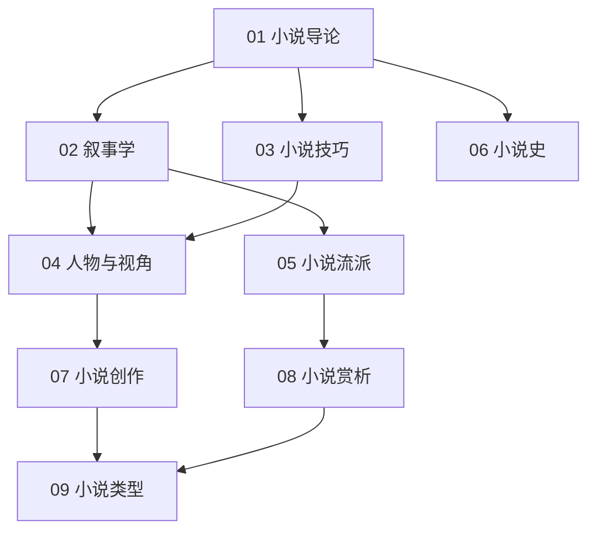

# 小说知识地图

## 分层学习路线

| 层级 | 技能 | 对应章节 |
|:--:|------|:--:|
| L1 | 理解小说定义、要素、分类 | 01 |
| L2 | 叙事学、技巧 | 02–03 |
| L3 | 人物视角、流派、小说史 | 04–06 |
| L4 | 创作、赏析、类型 | 07–09 |

## 三条主线

| 主线 | 内容 |
|------|------|
| **叙事线** | 叙述者 → 视角 → 叙事时间 → 意识流 |
| **实践线** | 情节 → 人物 → 悬念伏笔 → 创作 |
| **类型线** | 现实 → 现代 → 后现代 → 类型小说 |

## 关联

[[82-3-小说]] · [[3 Resources/8-Literature/raw/articles/82-3-小说/wiki/index|Wiki 索引]] · [[3 Resources/8-Literature/raw/articles/82-3-小说/99-资源收集/资源总览|资源总览]]
