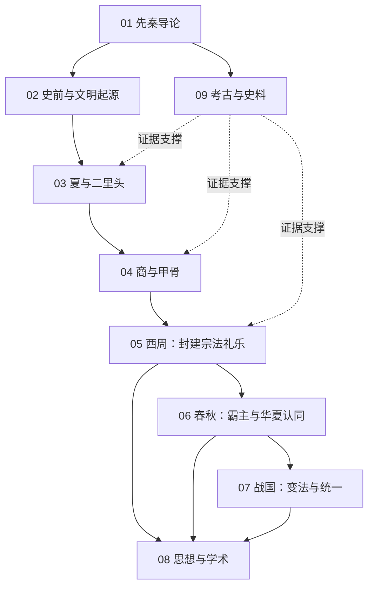

# 先秦知识地图

## 分层学习路线

| 层级 | 能力 | 对应章节 |
|:--:|------|:--:|
| L1 | 掌握时段、分期与史料分布 | 01 |
| L2 | 理解文明起源的多元格局与考古证据 | 02–03、09 |
| L3 | 理解王权、封建、宗法、礼乐的制度逻辑 | 04–05 |
| L4 | 理解礼崩乐坏、变法与诸子的因果关系 | 06–08 |

## 三条主线

| 主线 | 内容 |
|------|------|
| **制度线** | 多元并立 → 王权 → 封建宗法 → 霸主 → 变法郡县 |
| **思想线** | 天命与德 → 礼乐 → 礼崩乐坏 → 百家争鸣 |
| **证据线** | 传说 → 甲骨金文 → 简帛 → 二重证据法 |

## 三条线的交汇点

| 交汇 | 说明 |
|------|------|
| 天命观 | [[05-西周：封建宗法礼乐\|西周]]的「以德配天」既是政治合法性，也是[[08-思想与学术\|诸子]]争论的起点 |
| 礼崩乐坏 | [[06-春秋：霸主与华夏认同\|春秋]]的制度危机，直接催生[[百家争鸣-Hundred-Schools\|百家争鸣]] |
| 二重证据法 | [[王国维-Wang-Guowei\|王国维]]以甲骨证商史，把[[09-考古与史料\|考古]]变成了[[03-夏与二里头\|夏]]之争的裁判台 |

## 关联

[[94(510)-先秦]] · [[3 Resources/9-HistoryGeography/raw/articles/94(510)-先秦/wiki/index|Wiki 索引]] · [[3 Resources/9-HistoryGeography/raw/articles/94(510)-先秦/99-资源收集/资源总览|资源总览]]
