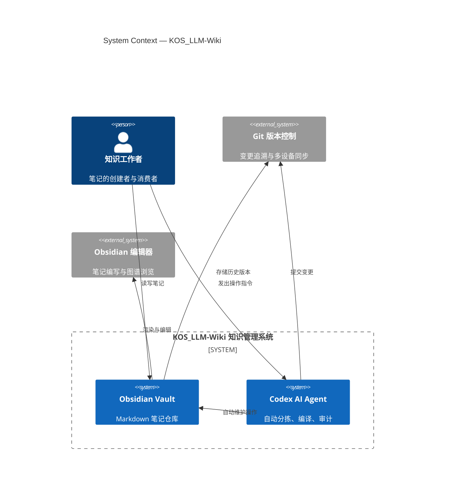
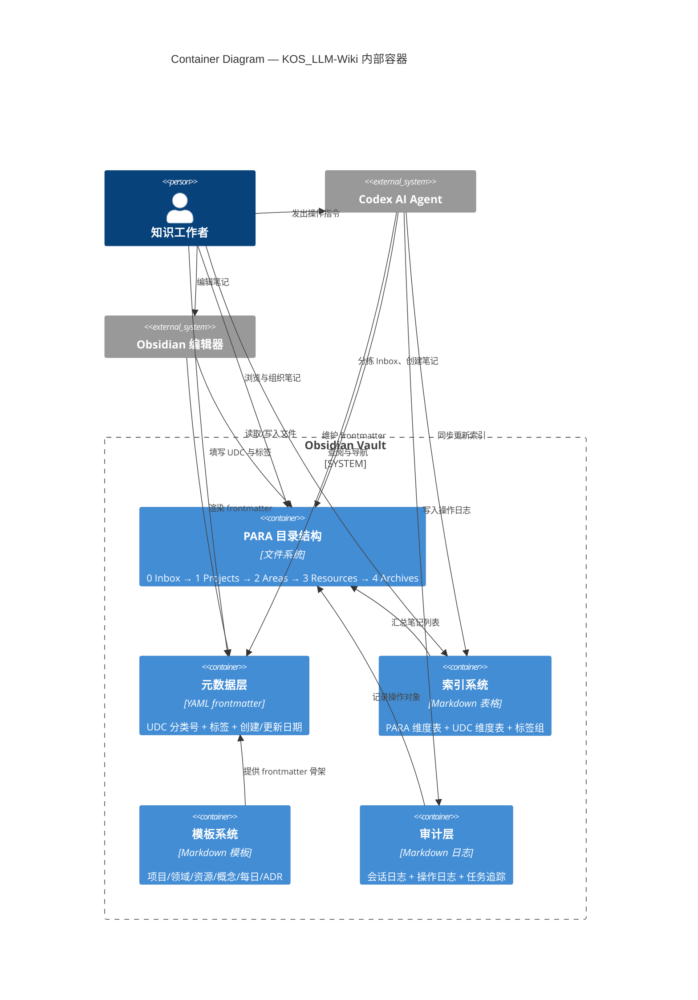
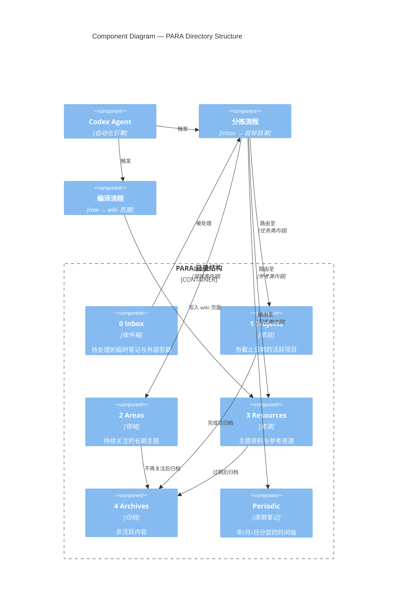
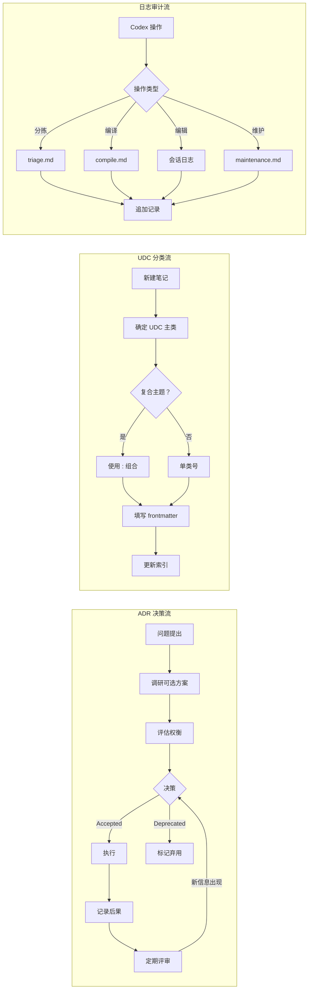

---
created: 2026-06-06
updated: 2026-06-06
udc: 004.4
tags: [c4, architecture, diagram, software-engineering]
---

# C4 模型示例图 — KOS_LLM-Wiki

> **参考架构：** PARA × LLM-Wiki 融合系统 + LifeOS 设计哲学
> **工具：** Mermaid.js（Markdown 内联渲染）

---

## L1 — Context 系统上下文

### L1 说明

| 元素 | 角色 |
|------|------|
| **知识工作者** | 系统的核心用户。创建笔记、发出指令、消费知识 |
| **Obsidian Vault** | Markdown 笔记仓库。存储所有内容与元数据 |
| **Codex AI Agent** | 自动化维护引擎。执行分拣、编译、日志记录 |
| **Git** | 版本控制后端。确保变更可追溯、可回滚 |
| **Obsidian 编辑器** | 前端工具。提供图谱视图、双向链接、模板等功能 |

---

## L2 — Container 容器视图

### L2 说明

| 容器 | 技术实现 | 职责 |
|------|----------|------|
| **PARA 目录结构** | 文件系统目录 | 按 Inbox/Projects/Areas/Resources/Archives 组织笔记 |
| **元数据层** | YAML frontmatter | 每条笔记的 UDC 分类号、标签、时间戳 |
| **索引系统** | Markdown 表格 | 总索引（PARA 表 + UDC 表 + 标签组） |
| **模板系统** | Templater 模板 | 新建笔记时的标准化骨架 |
| **审计层** | Markdown 日志 | Codex 操作的全链路审计追踪 |

---

## L3 — Component 组件视图：PARA 目录结构

### L3 说明

| 组件 | 生命周期 | 操作者 |
|------|----------|--------|
| **0 Inbox** | 捕获 → 处理 | 人类写入，Codex 分拣 |
| **1 Projects** | 执行 → 归档 | 人类 + Codex |
| **2 Areas** | 维护 → 归档 | 人类 + Codex |
| **3 Resources** | 参考 → 归档 | 人类写入 raw，Codex 编译 wiki |
| **4 Archives** | 休眠 | Codex 自动归档 |
| **Periodic** | 日记 | 人类 + Codex |

---

## L4 — Code 层级（ADR 决策记录范式）

---

## 图例与使用说明

| C4 层 | 视图 | 读者 | 文件位置 |
|-------|------|------|----------|
| L1 Context | 系统全景 | 所有参与者 | `_meta/assets/c4-context.md` |
| L2 Container | 技术容器 | 架构师、开发者 | `_meta/assets/c4-container.md` |
| L3 Component | 组件细节 | 开发者 | `_meta/assets/c4-component.md` |
| L4 Code | 关键模式 | 开发者 | `_meta/assets/c4-patterns.md` |

### Mermaid 渲染要求

本系统 C4 图使用 Mermaid.js 语法。Obsidian 中需要安装 **Mermaid** 插件或启用 **Obsidian 原生 Mermaid** 支持（v1.8+ 内置）。如使用 Obsidian Publish，Mermaid 图自动渲染。

---

> **维护者：** 这些 C4 图应与 `_meta/架构说明书.md` 同步更新。当系统架构发生变更时，更新对应层次的图。

