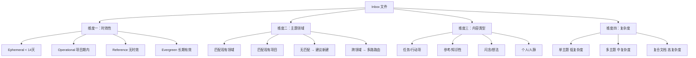
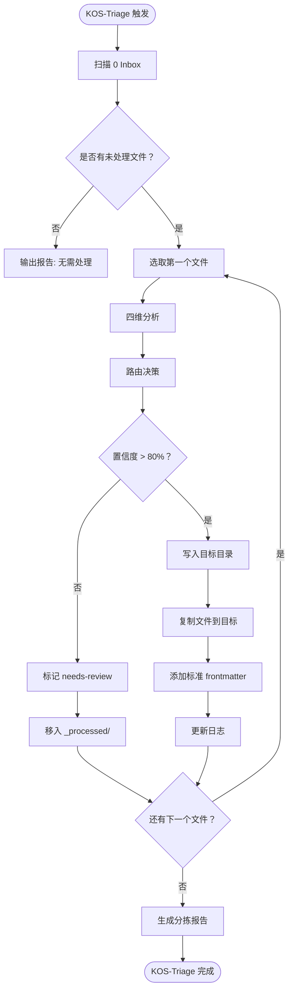

# KOS-Triage Skill 原型设计

> **版本：** v0.1 原型
> **状态：** Draft
> **参考：** [[_meta/v1.1-子模块分解.md]] · [[_meta/v1.1规划.md]] · LifeOS × LLM-Wiki 融合系统

---

## 1. 系统概述

### 1.1 定位

KOS-Triage 是 KOS_LLM-Wiki 的 Inbox 分拣引擎，负责将 `0 Inbox/` 中的未处理内容自动路由到目标目录。其核心能力是**内容维度分析 → 路由决策 → 目标写入 → 审计日志**的全链路自动化。

### 1.2 设计原则

| 原则 | 说明 |
|------|------|
| **追加不删除** | 原始内容复制到目标目录，永不从 Inbox 物理删除 |
| **保留痕迹** | 已分拣文件移入 `0 Inbox/_processed/`，保留原始时间戳 |
| **低置信度转人工** | 无法明确分类的内容标记 `needs-review`，不做强制分类 |
| **日志全链路** | 每次分拣操作记录到 `_logs/operations/triage.md` |
| **幂等性** | 已标记 `triage: processed` 的文件不重复处理 |

### 1.3 触发方式

| 方式 | 命令 | 说明 |
|------|------|------|
| 手动触发 | `KOS-Triage` | 处理所有未分拣文件 |
| 手动触发 | `KOS-Triage --file <路径>` | 处理单个指定文件 |
| 状态查询 | `KOS-Triage --status` | 查看当前 Inbox 待处理状态 |
| 自动提示 | 会话开始检查 | 检测 0 Inbox 非空时提示用户 |

---

## 2. 内容维度分析

### 2.1 四维分类模型

每一篇 Inbox 内容从四个维度进行独立分析，综合判定路由目标。



### 2.2 判断标准

#### 维度 A：时效性分析

| 分类 | 判断依据 | 生命周期 | 示例 |
|------|----------|----------|------|
| **Ephemeral** | 含具体日期 + 动作动词（买/约/提醒/发送/完成） | < 14 天 | 「周六前买牛奶」「下周三开会」 |
| **Operational** | 含项目名称 + 任务描述，无明确截止日期 | 项目期内 | 「调研 RAG 方案」「整理测试报告」 |
| **Reference** | 技术文章/论文/教程/书摘，无时效性 | 长期 | 「Transformer 论文摘要」「Python 教程笔记」 |
| **Evergreen** | 原则/方法论/核心概念，可长期使用 | 永久 | 「SOLID 原则」「PARA 方法笔记」 |

#### 维度 B：主题领域

通过关键词匹配识别内容所属的 KOS 领域：

| 领域关键词 | 匹配路由 | UDC |
|-----------|----------|-----|
| LLM / 大模型 / AI / 神经网络 / Transformer | `3 Resources/LLM-Wiki/` | 004.8 |
| PARA / 知识管理 / PKM / GTB | `3 Resources/PARA/` | 001.8 |
| UDC / 分类 / 十进分类 | `3 Resources/UDC/` | 025.4 |
| 软件工程 / 架构 / 设计模式 / C4 / ADR | `2 Areas/软件工程架构设计` | 004.4 |
| 知识组织 / KOS / 元数据 | `2 Areas/知识管理` | 001.8 |
| 匹配 `1 Projects/` 下活跃项目名 | `1 Projects/[项目名]/` | 项目 UDC |

> 无匹配时标记 `topic: needs-mapping` 并建议新建子库。

#### 维度 C：内容类型

| 类型 | 判定 | 路由策略 |
|------|------|----------|
| **任务** | Action verbs + 可交付物 | `1 Projects/[项目]/tasks.md` 或 `Periodic/` |
| **参考** | 知识性内容、无动作动词 | `3 Resources/[topic]/` |
| **闪念** | 碎片化想法、< 50 字 | `Periodic/` 的 Fleeting Ideas 区块 |
| **人脉** | 含人物姓名 + 背景信息 | 标记人脉，触发 People CRM 更新 |
| **剪藏** | 来自 Web Clipper/外部来源 | `0 Inbox/Clippings/` 保留 或 移入 `3 Resources/` |

#### 维度 D：复杂度

| 复杂度 | 判定 | 处理策略 |
|--------|------|----------|
| **低** | 单主题、< 500 字 | 直接路由，无需特殊处理 |
| **中** | 多主题交叉、500–2000 字 | 路由后标记 `split: true` 建议拆分 |
| **高** | 复合文档、> 2000 字、含多段独立内容 | 路由到 `_processed/` 并标记 `needs-attention` |

---

## 3. 路由决策矩阵

### 3.1 标准路由表

| 时效性 | 主题 | 类型 | 目标目录 | 额外操作 |
|--------|------|------|----------|----------|
| Ephemeral | 任何 | 任务 | `Periodic/` 或 `1 Projects/[项目]/tasks.md` | 追加 Obsidian Task 条目 |
| Ephemeral | 任何 | 闪念 | `Periodic/` Fleeting Ideas | 追加列表项 |
| Operational | 匹配项目 | 任务 | `1 Projects/[项目]/` | 更新 tasks.md |
| Operational | 匹配领域 | 参考 | `2 Areas/[领域]/` | — |
| Reference | 匹配子库 | 参考 | `3 Resources/[子库]/` | 标记待编译 `compiled: false` |
| Reference | 无匹配 | 参考 | `0 Inbox/_processed/` | `needs-review` |
| Evergreen | 匹配子库 | 知识 | `3 Resources/[子库]/` | 优先编译 |
| Evergreen | 无匹配 | 原则 | `2 Areas/` 建议新领域 | `needs-review` |
| 人脉内容 | 任何 | 人脉 | `3 Resources/people/`（预留） | 触发 CRM 更新 |
| 剪藏 | 匹配子库 | 外部 | `3 Resources/[子库]/` | 标记来源 `origin: webclipper` |
| 剪藏 | 无匹配 | 外部 | `0 Inbox/Clippings/` | `needs-review` |

### 3.2 双重属性处理

当内容同时具备「任务属性」和「知识属性」时，执行双重路由：

```yaml
# 例：「下周前读完这篇 Transformer 论文」
路由 A（任务）: 1 Projects/[项目]/tasks.md → 追加任务条目
路由 B（知识）: 3 Resources/LLM-Wiki/ → 原始文件复制至此
```

双重路由的文件在 frontmatter 中标记 `dual-routed: true`。

---

## 4. 处理流程

### 4.1 主流程



### 4.2 文件处理细节

#### Step 1: 扫描

```
输入: 0 Inbox/ 目录
过滤条件:
  - 排除 _processed/ 子目录
  - 排除已标记 triage: processed 的文件（frontmatter 字段）
  - 排除目录本身（仅处理文件）
输出: 待处理文件列表
```

#### Step 2: 四维分析

对每个文件执行：
1. 读取完整内容
2. 时效性分析（维度 A）
3. 主题识别（维度 B）— 关键词匹配 + UDC 启发式
4. 类型判定（维度 C）— 动作动词检测 + 内容结构分析
5. 复杂度评估（维度 D）— 字数 + 主题数量

#### Step 3: 路由决策

匹配路由决策矩阵（第 3.1 节），确定：
- 目标目录
- 额外操作（追加 task / 标记编译 / 触发更新等）
- 置信度评分

#### Step 4: 写入目标

```
1. 复制文件到目标目录（保持原始内容不变）
2. 在目标文件顶部添加/更新标准 frontmatter
3. 如需要，追加条目到 tasks.md 或 Periodic/
4. 将原始文件移入 0 Inbox/_processed/
```

#### Step 5: 日志记录

追加到 `_logs/operations/triage.md`（格式见第 6 节）。

---

## 5. Frontmatter 标准

### 5.1 分拣后的文件 frontmatter

```yaml
---
created: YYYY-MM-DD
updated: YYYY-MM-DD
udc: <类号>              # 分拣时自动匹配，如无法确定留空
tags: [triage, <路由标签>]
triage:
  status: processed      # processed | needs-review | skipped
  date: YYYY-MM-DD
  confidence: high       # high | medium | low
  source: 0 Inbox/<原文件名>
  route: <目标目录路径>
  dual-routed: false     # true 表示双路路由
lifecycle: <ephemeral | operational | reference | evergreen>
origin: manual           # manual | webclipper | voice | email | ai-generated
---
```

### 5.2 已处理文件标记（_processed/ 中）

```yaml
---
triage:
  status: processed
  date: YYYY-MM-DD
  confidence: medium
  route: 3 Resources/LLM-Wiki/
  processed-action: copy  # copy | split | needs-review
---
```

---

## 6. 日志与审计格式

### 6.1 日志模板（_logs/operations/triage.md）

每次分拣操作追加一条记录：

```markdown
## 2026-06-06T18:30

- **操作**：KOS-Triage
- **处理文件数**：3
- **处理详情**：
  | 文件 | 路由 | 置信度 | 生命周期 |
  |------|------|--------|----------|
  | 笔记A.md | 3 Resources/LLM-Wiki/ | high | reference |
  | 笔记B.md | Periodic/ | high | ephemeral |
  | 笔记C.md | 0 Inbox/_processed/ | low | — (needs-review) |
- **路由分布**：
  - 3 Resources：1 个
  - Periodic：1 个
  - needs-review：1 个
- **建议**：LLM-Wiki 子库有新入库资料，建议运行 Wiki Compile
```

### 6.2 报告输出格式

分拣完成后输出给用户的摘要：

```markdown
## KOS-Triage 分拣报告

处理文件：3 个
├── 已路由：2 个
│   ├── 3 Resources/LLM-Wiki/ ← 笔记A.md (reference)
│   └── Periodic/             ← 笔记B.md (ephemeral)
└── 待人工确认：1 个
    └── 笔记C.md → needs-review（无匹配领域，建议创建新子库）

建议下一步：
- 运行 `KOS-Compile LLM-Wiki` 编译新入库资料
- 人工审查 needs-review 文件
```

---

## 7. 示例场景

### 场景一：技术文章剪藏

**输入：** `2026-06-06-Transformer-论文解读.md`（从 Web Clipper 导入的 2000 字文章）

| 维度 | 分析结果 |
|------|----------|
| 时效性 | Reference（无时效性内容） |
| 主题 | 匹配 LLM-Wiki（关键词：Transformer） |
| 类型 | 参考/知识性 |
| 复杂度 | 中（1500 字，单主题） |

**路由：** `3 Resources/LLM-Wiki/` + `compiled: false`

**额外操作：** 无（等待 Wiki Compile）

---

### 场景二：任务提醒

**输入：** `记得周五前提交周报.md`（20 字短内容）

| 维度 | 分析结果 |
|------|----------|
| 时效性 | Ephemeral（含"周五前"日期和"提交"动作） |
| 主题 | 无特定领域匹配 |
| 类型 | 任务 |
| 复杂度 | 低 |

**路由：** `Periodic/` 追加 task 条目 `- [ ] 提交周报 📅 2026-06-09`

---

### 场景三：复合文档

**输入：** `LLM 知识管理方案.md`（3000 字，含技术方案 + 项目计划）

| 维度 | 分析结果 |
|------|----------|
| 时效性 | Operational（项目相关） |
| 主题 | 匹配 LLM-Wiki + 知识管理（跨领域） |
| 类型 | 参考 + 任务（双重属性） |
| 复杂度 | 高 |

**路由 A（任务）：** `1 Projects/[项目名]/tasks.md` 追加
**路由 B（知识）：** `3 Resources/LLM-Wiki/` 复制

**标记：** `dual-routed: true`

---

## 8. AGENTS.md 集成

### 8.1 章节模板

KOS-Triage 规则应写入 `AGENTS.md` 的独立章节：

```markdown
## KOS-Triage 分拣引擎

### 触发方式
- 手动：用户输入 `KOS-Triage`
- 自动：会话开始时检测 0 Inbox 非空则提示

### 分拣规则
[四维分析标准 → 路由决策矩阵 → 处理流程]

### 禁止行为
- 不自动删除任何文件（仅复制/移动）
- 不修改 raw 目录中的原始文件
- 不强制分类低置信度内容
```

### 8.2 与现有系统的衔接

| 系统 | 衔接点 |
|------|--------|
| `_logs/operations/triage.md` | 每次分拣后追加操作记录 |
| `_logs/sessions/` | 分拣操作在会话摘要中引用 |
| `AGENTS.md` | 分拣规则定义 |
| `_index.md` | 新创建的文件自动索引（下次更新时） |

---

## 9. 边界情况处理

| 场景 | 处理策略 |
|------|----------|
| 文件无法读取 | 跳过并记录错误日志 |
| 内容 < 10 字 | 默认归入 `Periodic/` 闪念 |
| 内容 > 10000 字 | 标记 `long-doc`，建议人工拆分 |
| 纯图片/二进制 | 移入 `0 Inbox/_processed/` 标记 `media: true` |
| 重名文件 | 目标目录已存在同名 → 追加时间戳后缀 |
| 全英文内容 | 正常分拣（KOS-Triage 语言中性） |
| 编码异常 | 尝试 UTF-8/GBK 回退，失败则跳过 |

---

## 10. 实施检查清单

- [ ] AGENTS.md 写入 KOS-Triage 章节
- [ ] `0 Inbox/_processed/` 目录创建
- [ ] `_logs/operations/triage.md` 首次创建并写入模板
- [ ] 路由决策矩阵验证（覆盖所有现有目录）
- [ ] 关键词匹配表初始化（覆盖现有领域/项目）
- [ ] 首次分拣演练（至少 3 个测试文件）
- [ ] 边界情况测试（空文件、长文、图片等）
- [ ] 报告输出格式验证

---

> **文档维护：** 本原型设计在实施过程中持续更新。每次迭代后更新状态字段。
> **关联文档：** [[_meta/v1.1-子模块分解.md]] · [[_meta/架构说明书.md]] · [[_logs/_index.md]]

