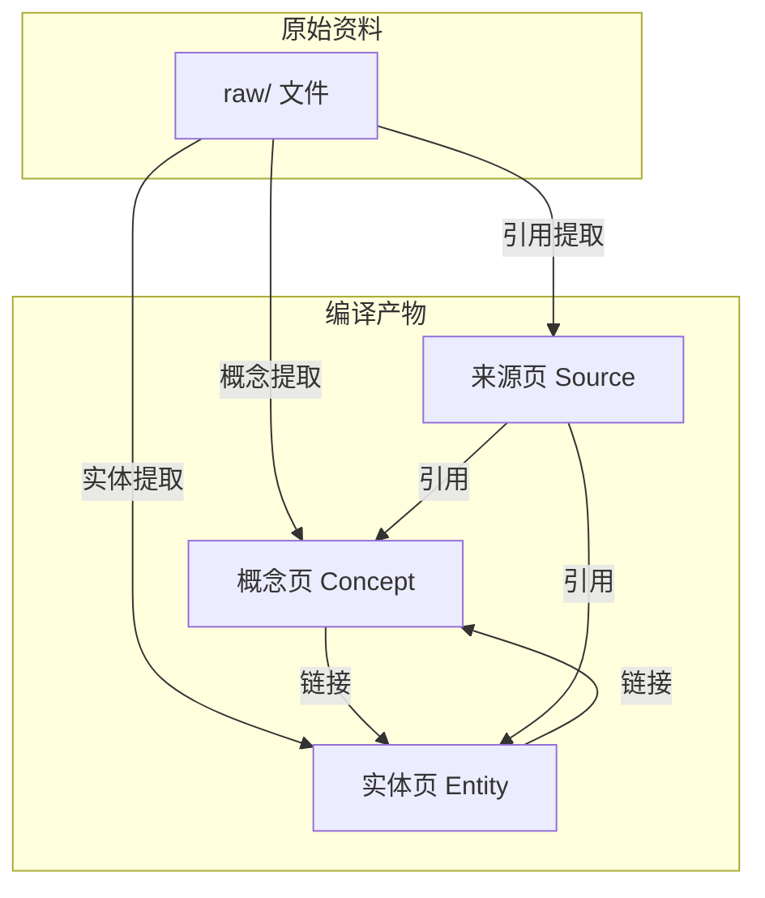
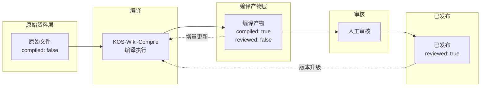

# KOS-Wiki-Compile Skill 原型设计

> **版本：** v0.1 原型
> **状态：** Draft
> **前置依赖：** [[_meta/design/KOS-Triage原型设计.md]]
> **参考：** [[_meta/v1.1-子模块分解.md]] · [[_meta/v1.1规划.md]] · [[_meta/Templates/概念模板.md]]

---

## 1. 系统概述

### 1.1 定位

KOS-Wiki-Compile 是 KOS_LLM-Wiki 的 Wiki 编译引擎，负责将 `3 Resources/` 中的原始资料（raw）自动编译为结构化知识页面（wiki）。其核心能力是 **来源分析 → 概念提取 → 页面创建 → 交叉引用 → 索引更新 → 审计日志** 的全链路自动化。

### 1.2 设计原则

| 原则 | 说明 |
|------|------|
| **来源可溯** | 每个编译产物必须标注来源，支持反向追溯原始资料 |
| **编译状态可见** | 原始资料通过 frontmatter `compiled: true/false` 标记状态 |
| **增量编译** | 仅处理 `compiled: false` 或来源变更的原始资料 |
| **人工审核门** | 编译产物标记 `compiled: true`，但 `reviewed: false` 等待确认 |
| **不破坏原始资料** | 原始 raw 文件不被修改，编译产物写入独立目录 |
| **交叉引用自动** | 编译中新建立的 `[[链接]]` 自动追加到目标页面的反向引用区 |

### 1.3 触发方式

| 方式 | 命令 | 说明 |
|------|------|------|
| 手动触发 | `KOS-Wiki-Compile` | 编译所有未编译的原始资料 |
| 手动触发 | `KOS-Wiki-Compile --topic <主题>` | 编译指定子库下的所有原始资料 |
| 手动触发 | `KOS-Wiki-Compile --file <路径>` | 编译单个指定原始资料 |
| 状态查询 | `KOS-Wiki-Compile --status` | 查看编译状态总览（已编译/待编译/待审核） |
| 自动提示 | 会话开始检查 | 检测 3 Resources 中存在未编译资料时提示用户 |

### 1.4 与相邻系统的关系

| 系统 | 关系 |
|------|------|
| **KOS-Triage** | Triage 将 Inbox 内容路由到 3 Resources/ raw 目录作为原始资料 |
| **KOS-Wiki-Compile** | 本系统，将 raw 编译为 wiki 知识页面 |
| **索引系统** | 编译完成后自动更新 `_索引.md` 及多语言镜像 |
| **审计日志** | 每次编译操作记录到 `_logs/operations/compile.md` |

---

## 2. 编译流程

### 2.1 六步管道

```mermaid
flowchart LR
    A[来源分析] --> B[概念提取]
    B --> C[页面创建/更新]
    C --> D[交叉引用]
    D --> E[索引更新]
    E --> F[日志记录]

    A --> A1[读取原始资料<br/>检测 frontmatter<br/>判断编译状态]
    B --> B1[识别关键概念<br/>实体和关系<br/>确定页面类型]
    C --> C1[使用模板创建<br/>或更新现有页面<br/>补充 frontmatter]
    D --> D1[扫描新页面中的 [[链接]]<br/>追加到目标页面的<br/>反向引用区域]
    E --> E1[更新分类索引<br/>目录结构映射<br/>多语言同步]
    F --> F1[写入 compile.md<br/>记录来源/新建/更新<br/>矛盾与异常]
```

### 2.2 步骤详解

#### 步骤 A — 来源分析

扫描 `3 Resources/` 下所有子库，识别未编译的原始资料。

```
输入: 3 Resources/<子库>/ 目录下所有文件
筛选: frontmatter 中 compiled: false 或 absent
      (忽略 compiled: true 的文件，保证幂等性)
输出: 待编译文件列表 + 各文件的元数据摘要
```

**文件筛选条件：**

| 条件 | 处理 |
|------|------|
| `compiled: false` 或缺失 | 纳入编译队列 |
| `compiled: true` | 跳过（幂等） |
| 非 .md 文件 | 跳过，仅记录到日志 |
| 文件 < 50 字 | 标记 `too-short`，建议人工确认 |
| 文件 > 10000 字 | 标记 `long-doc`，建议拆分后编译 |

#### 步骤 B — 概念提取

分析原始资料内容，识别可编译的知识单元。

| 维度 | 识别方法 | 示例 |
|------|----------|------|
| 核心概念 | 标题、重复出现的关键词、定义性语句 | "Transformer 是一种..." |
| 实体 | 命名实体识别（人名、产品名、框架名） | "GPT-4", "Llama 2" |
| 关系 | 概念间的比较、依赖、层次结构 | "RAG 依赖向量数据库" |
| 来源 | 引用、链接、文中提到的外部资料 | "参见 Attention Is All You Need" |

**输出：** 概念提取清单，每个概念标注类型（Concept / Entity / Source）和置信度。

#### 步骤 C — 页面创建/更新

根据提取的概念，使用对应模板创建或更新 Wiki 页面。

```
输入: 概念提取清单 + 对应模板
处理:
  - 目标页面不存在 → 按模板新建
  - 目标页面已存在 → 合并新内容到现有页面（追加、更新、标注冲突）
输出: 创建/更新后的 Wiki 页面
```

**冲突处理策略：**

| 场景 | 策略 |
|------|------|
| 新内容与现有内容一致 | 跳过（不重复写入） |
| 新内容补充现有内容 | 追加到对应章节 |
| 新内容与现有内容矛盾 | 同时保留双方并标注 `conflict: true`，等待人工审核 |
| 新内容完全覆盖现有内容 | 仅更新版本号，保留旧内容在 `_archived/` |

#### 步骤 D — 交叉引用

扫描新创建/更新的页面中的 `[[链接]]`，自动追加反向引用。

```
输入: 新增页面内容
处理:
  1. 提取所有 [[目标页面]] 引用
  2. 对每个目标页面，在「相关笔记」或「反向引用」区域追加一行
  3. 格式: - [[源页面|源页面标题]] — 关联原因
输出: 更新后的目标页面反向引用区
```

**关联原因推导：**

| 上下文模式 | 关联原因 |
|-----------|----------|
| "参见 [[X]]" | 直接引用 |
| "[[X]] 是一种..." | 主体定义引用 |
| "与 [[X]] 不同" | 比较引用 |
| "基于 [[X]]" | 依赖/继承引用 |

#### 步骤 E — 索引更新

编译完成后，更新全局索引文件。

| 索引 | 更新内容 |
|------|----------|
| `_索引.md` | 新增页面的标题 + UDC + 标签 + 路径 |
| `en/_index.md` | 英文版同步新增条目 |
| `zh-tw/_index.md` | 繁体版同步新增条目 |
| 目录索引 | 如 3 Resources/LLM-Wiki/ 下新增页面 → 更新对应索引 |

#### 步骤 F — 日志记录

每次编译操作完整记录到 `_logs/operations/compile.md`。

日志格式见第 6 节。

---

## 3. 页面类型体系

### 3.1 三种编译类型



### 3.2 概念页 (Concept Page)

**用途：** 定义核心概念、理论、方法。

```yaml
# frontmatter
---
created: YYYY-MM-DD
updated: YYYY-MM-DD
udc: <UDC类号>
tags: [concept, wiki]
aliases: [同义词/别名]
compiled: true
compiled_from: "[[来源文件路径]]"
reviewed: false
---
```

```markdown
# 概念名称

> **概念** — 简洁定义。

## 定义

## 关键特征

## 工作原理 / 机制

## 与其他概念的关系

| 概念 | 关系 | 说明 |
|------|------|------|
| [[相关概念1]] | 依赖 | 描述 |
| [[相关概念2]] | 对比 | 描述 |

## 应用场景

## 参考来源
- [[来源页路径]] — 章节/页码
```

### 3.3 实体页 (Entity Page)

**用途：** 描述具体的人、产品、框架、工具、组织。

```yaml
---
created: YYYY-MM-DD
updated: YYYY-MM-DD
udc: <UDC类号>
tags: [entity, wiki]
aliases: [缩写/别称]
compiled: true
compiled_from: "[[来源文件路径]]"
reviewed: false
entity_type: tool | person | framework | organization | product
---
```

```markdown
# 实体名称

> **实体** — 一句话定位（例如：Google 开发的大语言模型系列）。

## 基本资料

| 属性 | 值 |
|------|-----|
| 类型 | 框架 / 产品 / 人物 |
| 开发者 | 组织名 |
| 发布时间 | YYYY-MM |
| 最新版本 | vX.Y |
| 官网 | URL |

## 核心特性

## 生态与相关实体

## 参考来源
- [[来源页路径]]
```

### 3.4 来源页 (Source Page)

**用途：** 记录外部引用资料的元数据。

```yaml
---
created: YYYY-MM-DD
updated: YYYY-MM-DD
udc: <UDC类号>
tags: [source, wiki]
compiled: true
compiled_from: "[[来源文件路径]]"
reviewed: false
source_type: paper | article | book | video | website
---
```

```markdown
# 来源标题

> **来源** — 简要说明（论文/文章/书籍/视频）。

## 元数据

| 属性 | 值 |
|------|-----|
| 标题 | 完整标题 |
| 作者 | 作者名 |
| 出版日期 | YYYY-MM-DD |
| 链接 | URL |
| 来源类型 | paper / article / book |

## 摘要

## 关键引用（从当前库中引用此来源的页面）
- [[概念页1]]
- [[实体页2]]

## 标签索引
```

---

## 4. Frontmatter 约定

### 4.1 原始资料 frontmatter（raw 层）

```yaml
---
created: YYYY-MM-DD
updated: YYYY-MM-DD
udc: <UDC类号>
tags: [resource, raw]      # raw 标签标识原始资料
compiled: false             # 编译状态：false 或 true
compiled_at:                # 留空或 YYYY-MM-DDTHH:MM
compiled_by:                # 留空或 "KOS-Wiki-Compile"
---
```

### 4.2 编译产物 frontmatter（wiki 层）

```yaml
---
created: YYYY-MM-DD
updated: YYYY-MM-DD
udc: <UDC类号>
tags: [concept|entity|source, wiki]   # wiki 标签标识编译产物
compiled: true                         # 编译状态
compiled_from: "[[来源文件]]"          # 来源追溯
compiled_at: "2026-06-06T23:30"        # 编译时间戳
compiled_by: "KOS-Wiki-Compile"        # 编译引擎
compiled_version: 1                     # 编译版本（递增）
reviewed: false                         # 人工审核标志
reviewed_at:                            # 审核时间（留空）
---
```

### 4.3 生命周期图



---

## 5. KOS-Wiki-Compile 规则（AGENTS.md 植入文本）

以下为 `AGENTS.md` 中需要新增的 KOS-Wiki-Compile 完整章节。可直接复制粘贴。

```markdown
## KOS-Wiki-Compile 编译引擎

### 触发方式
- 用户输入 `KOS-Wiki-Compile`，对所有未编译原始资料执行编译
- 用户输入 `KOS-Wiki-Compile --topic <子库名>`，仅编译指定子库
- 用户输入 `KOS-Wiki-Compile --file <路径>`，仅编译单个文件
- 用户输入 `KOS-Wiki-Compile --status`，查看编译状态总览
- 自动提示：会话开始检测 3 Resources/ 中 compiled: false 的原始资料

### 扫描规则
1. 读取 3 Resources/ 下所有子库目录中的 .md 文件
2. 忽略 frontmatter 中 `compiled: true` 的文件（幂等性）
3. 忽略非 .md 文件（仅记录到日志）
4. 跳过文件长度 < 50 字的文件，标记 `too-short`
5. 标记文件长度 > 10000 字的文件为 `long-doc`，建议拆分

### 编译流程
1. **来源分析** — 读取原始资料 frontmatter 和内容，确定主题领域
2. **概念提取** — 从内容中识别可编译的知识单元（概念/实体/来源）
3. **页面创建/更新** — 使用对应模板创建或更新 Wiki 页面
4. **交叉引用** — 提取新页面中的 [[链接]]，追加到目标页面的反向引用区
5. **索引更新** — 更新 _索引.md 及多语言镜像
6. **日志记录** — 写入 _logs/operations/compile.md

### 编译产物类型
- **概念页 (Concept)** — udc 含 concept 标签，使用概念模板
- **实体页 (Entity)** — udc 含 entity 标签，使用实体模板
- **来源页 (Source)** — udc 含 source 标签，使用来源模板

### 冲突处理
- 新内容与现有一致 → 跳过
- 新内容补充现有 → 追加
- 新内容与现有矛盾 → 同时保留，标记 conflict: true
- 完全覆盖 → 旧内容移入 _archived/

### 禁止行为
- 不修改原始 raw 文件
- 不自动删除任何文件
- 不修改 reviewed: true 的已审核页面（除非显式请求）
- 不覆盖人工编辑的内容（检测到人工编辑标记则跳过）
```

---

## 6. 日志格式

### 6.1 compile.md 日志结构

`_logs/operations/compile.md` 每次编译操作追加记录。

```markdown
# 编译操作日志

> KOS-Wiki-Compile 的每次编译操作在此追加记录。

| 日期 | 操作 | 处理数 | 新建 | 更新 | 跳过 | 冲突 | 参考 |
|------|------|--------|------|------|------|------|------|
| YYYY-MM-DD | full | 5 | 3 | 1 | 1 | 0 | — |

## YYYY-MM-DDTHH:MM

- **操作**：KOS-Wiki-Compile
- **触发方式**：manual / auto
- **主题范围**：LLM-Wiki / PARA / UDC / all
- **处理文件数**：5
- **编译结果**：
  | 来源文件 | 编译产物 | 类型 | 操作 |
  |----------|----------|------|------|
  | raw/LLM 基础.md | wiki/LLM 基础.md | concept | created |
  | raw/Transformer.md | wiki/Transformer 架构.md | concept | updated |
- **新建页面**：3
- **更新页面**：1
- **跳过（已编译）**：1
- **冲突标记**：0
- **交叉引用追加**：5 个链接
- **状态**：success
```

### 6.2 日志级别

| 级别 | 场景 | 动作 |
|------|------|------|
| info | 正常编译、无冲突 | 写入摘要行 |
| warn | 标记 `too-short` / `long-doc` / 编码异常 | 写入 + 提醒 |
| error | 编译失败、文件损坏 | 写入 + 停止当前任务 |

---

## 7. 边界情况处理

| 场景 | 处理策略 |
|------|----------|
| 原始文件不可读 | 跳过并记录错误日志 |
| 文件 < 50 字 | 标记 `too-short`，不编译，建议人工补充 |
| 文件 > 10000 字 | 标记 `long-doc`，建议人工拆分为多个主题 |
| 编译产物已存在但 reviewed: true | 不覆盖，记录到日志 |
| 编译产物已存在但 reviewed: false | 合并更新新内容 |
| 跨语言冲突（同一概念不同语言） | 保留双方，标记 `lang-conflict` |
| 目标路径不存在 | 自动创建所需目录结构 |
| 链接指向不存在页面 | 保留链接，编译目标页面时自动补充 |

---

## 8. 实施检查清单

- [ ] AGENTS.md 写入 KOS-Wiki-Compile 章节
- [ ] 在 3 Resources 各子库下创建 `raw/` + `wiki/` 目录结构（依赖 M3）
- [ ] 原始资料 frontmatter 补充 `compiled: false` 字段
- [ ] 概念页/实体页/来源页三种模板创建
- [ ] `_logs/operations/compile.md` 首次创建并写入模板
- [ ] 交叉引用规则验证（至少 3 个页面形成闭环）
- [ ] 首次编译演练（至少 1 个主题完整走通六步管道）
- [ ] 冲突检测测试（人工构造矛盾内容）
- [ ] 幂等性验证（重复编译无副作用）
- [ ] 索引更新验证（_索引.md 正确新增条目）
- [ ] 日志格式验证

---

## 9. 与 M3 子库分层的关系

M3 Wiki 子库分层（raw/ + wiki/）是 KOS-Wiki-Compile 的生产环境前提，但原型设计阶段可暂用现有平面结构验证编译逻辑。

| 阶段 | 目录结构 | 说明 |
|------|----------|------|
| 原型验证（当前） | `3 Resources/LLM-Wiki/` 平面 | 编译产物与原始资料共存，通过 frontmatter 区分 |
| 生产环境（M3 后） | `3 Resources/LLM-Wiki/raw/` + `wiki/` | 原始资料与编译产物物理分离 |

**原型验证期间的 frontmatter 约定：**

| 文件角色 | 标签 | compiled |
|----------|------|----------|
| 原始资料 | `resource, raw` | `false` |
| 编译产物 | `concept, wiki` | `true` |

---

> **文档维护：** 本原型设计在实施过程中持续更新。每次迭代后更新状态字段。
> **关联文档：** [[_meta/v1.1-子模块分解.md]] · [[_meta/架构说明书.md]] · [[_meta/design/KOS-Triage原型设计.md]]
