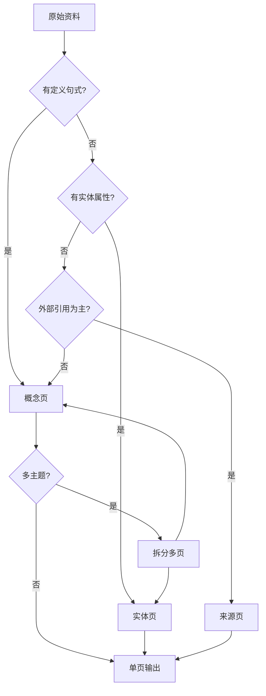

# KOS-Wiki-Compile 详细设计

> **版本：** v0.2 详细设计
> **状态：** Draft
> **前置文档：** [[_meta/design/KOS-Wiki-Compile原型设计.md]]
> **参考：** [[_meta/v1.1-子模块分解.md]] · [[_meta/Templates/概念模板.md]] · [[_logs/_index.md]]

---

## 1. AGENTS.md 植入文本

以下为 `AGENTS.md` 中需要新增的 KOS-Wiki-Compile 完整章节。可直接复制粘贴。

```markdown
## KOS-Wiki-Compile 编译引擎

### 触发方式
- 完整编译：用户输入 `KOS-Wiki-Compile`，对所有未编译原始资料执行编译
- 按主题：用户输入 `KOS-Wiki-Compile --topic <子库名>`，仅编译指定子库（LLM-Wiki / PARA / UDC）
- 单文件：用户输入 `KOS-Wiki-Compile --file <路径>`，仅编译单个文件
- 状态查询：用户输入 `KOS-Wiki-Compile --status`，返回编译状态总览
- 自动提示：每次会话开始，检测 3 Resources/ 中存在 `compiled: false` 的原始资料则提示用户

### 扫描规则
1. 读取 3 Resources/ 下所有子库目录中的 .md 文件
2. 若 M3 子库分层已完成，优先扫描 raw/ 子目录；否则扫描子库根目录
3. 忽略 frontmatter 中 `compiled: true` 的文件（幂等性）
4. 忽略非 .md 文件（仅记录到日志）
5. 文件 < 50 字 → 标记 `too-short`，跳过编译
6. 文件 > 10000 字 → 标记 `long-doc`，建议人工拆分

### 编译流程（六步管道）

**Step 1 — 来源分析**
读取文件 frontmatter 和全文，确定主题领域。
输出：待编译文件清单 + 各文件元数据摘要。

**Step 2 — 概念提取**
从内容中识别可编译的知识单元，决定页面类型：
- 核心理论/方法/原理 → **概念页 (Concept)**
- 工具/框架/产品/人物 → **实体页 (Entity)**
- 论文/文章/书籍引用 → **来源页 (Source)**

**Step 3 — 页面创建/更新**
使用对应模板创建或更新 Wiki 页面：
- 目标页面不存在 → 按模板新建
- 目标页面已存在且 `reviewed: false` → 合并更新
- 目标页面已存在且 `reviewed: true` → 跳过（不覆盖人工审核内容）

**Step 4 — 交叉引用**
扫描新页面中的 `[[链接]]`，追加到目标页面的反向引用区。
关联原因推导：
| 上下文 | 关联原因 |
|--------|----------|
| "参见 [[X]]" | 直接引用 |
| "[[X]] 是一种..." | 主体定义 |
| "与 [[X]] 不同" | 比较引用 |
| "基于 [[X]]" | 依赖关系 |

**Step 5 — 索引更新**
更新 _索引.md、en/_index.md、zh-tw/_index.md，新增条目。

**Step 6 — 日志记录**
写入 _logs/operations/compile.md。

### 冲突处理
| 场景 | 策略 |
|------|------|
| 新内容与现有一致 | 跳过（不重复写入） |
| 新内容补充现有 | 追加到对应章节 |
| 新内容与现有矛盾 | 双方保留，标记 `conflict: true` |
| 完全覆盖 | 旧版本移入页面 `_archived/` 子目录 |

### 输出要求
编译完成后，向用户输出以下格式的报告：

```markdown
## KOS-Wiki-Compile 结果
处理 N 个来源 → 新建 M 个 + 更新 K 个 + 跳过 S 个
├── 新建：
│   ├── [页面路径] ([类型]) ← [来源文件]
│   └── ...
├── 更新：
│   ├── [页面路径] (新增 X 章节)
│   └── ...
├── 跳过：
│   └── [来源文件] (原因: 已编译/太短/太长)
└── 冲突标记：C 个
交叉引用追加：L 个链接
建议：...
```

### 禁止行为
- 不修改原始 raw 文件（src 只读原则）
- 不自动删除任何文件
- 不修改 `reviewed: true` 的已审核页面（除非显式请求）
- 不覆盖人工编辑的内容
- 不对 `compiled: true` 的文件重复编译（幂等性）
```

---

## 2. 页面类型映射表

### 2.1 原始资料 → 编译类型判定

读取文件全文后，按以下规则判定最佳页面类型：

```yaml
# 优先级从上到下递减。匹配到第一个即停止。
Concept:
  indicators:
    - 内容含有定义性句式（"是一种" / "指的是" / "定义为" / "是指"）
    - 内容阐述原理、机制、方法论
    - 标题为抽象概念名（如 Transformer / RAG / 提示工程）
  tags_input: [concept, wiki]
  template: 概念模板

Entity:
  indicators:
    - 内容描述具体工具、框架、产品（含版本号/开发者信息）
    - 内容描述人物（含背景/贡献/作品）
    - 内容含有结构化属性表（名称/版本/价格等）
    - 标题为专有名词（GPT-4 / Llama 2 / 某公司名）
  tags_input: [entity, wiki]
  template: 实体模板（原型设计中）

Source:
  indicators:
    - 内容主要为引用/摘要/书摘/论文笔记
    - frontmatter 含 origin: webclipper 或类似标记
    - 内容含大量外部引用（URL / DOI / ISBN）
    - 标题含 "笔记" / "摘要" / "note" / "summary"
  tags_input: [source, wiki]
  template: 来源模板（原型设计中）

# 默认回退：无法明确判断时默认为概念页
Default:
  type: concept
  tags_input: [concept, wiki]
```

### 2.2 多主题来源的分拆策略

当来源资料覆盖多个主题时：

```yaml
splitting_strategy:
  # 来源内容覆盖不同主题域 → 分拆为多个编译产物
  condition: 内容可切分为 >= 2 个独立主题段落
  action:
    - 每段独立创建对应类型页面
    - 在来源页（Source）中记录拆分信息
    - 各碎片页面互相添加 [[链接]] 关联
  example:
    source: "LLM 与知识管理融合方案"
    output:
      - LLM 基础.md (concept)
      - 知识组织方法论.md (concept)
      connection: "\"LLM 基础\" 与 \"知识组织方法论\" 互为参见"
```

### 2.3 Mermaid 类型判定流程



---

## 3. Frontmatter 约定

### 3.1 原始资料 frontmatter（编译前）

原始资料在首次编译前需补充以下字段：

```yaml
---
created: 2026-06-01           # 保留原始创建日期
updated: 2026-06-06           # 更新为编译日期
udc: 004.8                    # 保留或补充
tags: [resource, raw, llm]   # 保留原有 + raw 标签
compiled: false               # 初始状态
compiled_at:                  # 留空
compiled_by:                  # 留空
---
```

### 3.2 编译产物 frontmatter（编译后）

```yaml
---
created: 2026-06-06           # 页面创建日期
updated: 2026-06-06           # 编译日期
udc: 004.8                    # 继承来源的 UDC 类号
tags: [concept, wiki, llm]   # 类型标签 + wiki 标签 + 领域标签
aliases:                      # 同义词/别名（从内容提取）
  - Large Language Model
  - 大模型
compiled: true                # 编译状态
compiled_from: "[[3 Resources/LLM-Wiki/LLM 基础.md]]"  # 来源追溯
compiled_at: "2026-06-06T23:30"                        # 编译时间戳
compiled_by: "KOS-Wiki-Compile"                        # 编译引擎
compiled_version: 1           # 编译版本（递增）
reviewed: false               # 人工审核标志
reviewed_at:                  # 审核时间（留空）
reviewed_by:                  # 审核人（留空）
conflict: false               # 是否存在内容冲突
---
```

### 3.3 更新时的 frontmatter 规则

```yaml
# 同一来源的增量编译
compiled_version: 2           # 版本递增
compiled_at: "2026-06-07T10:00"
updated: 2026-06-07
reviewed: false               # 更新后重置审核状态
conflict: false               # 如无冲突

# 发生冲突时
conflict: true
conflict_details:
  - section: "定义"           # 冲突章节
    original: "原文内容"      # 现有版本
    incoming: "新版本内容"    # 新版本
    resolution: pending       # pending | resolved
```

---

## 4. 伪代码实现

### 4.1 主流程

```python
def kos_wiki_compile(topic=None, file_path=None, status_only=False):
    # Step 1: 状态查询
    if status_only:
        return scan_compile_status()

    # Step 2: 获取待编译文件列表
    if file_path:
        sources = [validate_source(file_path)]
    elif topic:
        sources = scan_topic(topic)
    else:
        sources = scan_all()

    # Step 3: 过滤已编译
    pending = [s for s in sources if not is_already_compiled(s)]
    if not pending:
        return report("所有原始资料均已编译")

    # Step 4: 逐文件编译
    results = {'created': [], 'updated': [], 'skipped': [], 'conflicts': []}
    cross_refs = []

    for src in pending:
        page_type = classify_page_type(src.content)    # 类型判定
        template = load_template(page_type)            # 加载模板

        existing = find_existing_page(src, page_type)

        if existing and existing.frontmatter.get('reviewed') == True:
            results['skipped'].append((src, 'reviewed page'))
            continue

        if existing:
            merged, has_conflict = merge_content(existing, src, template)
            if has_conflict:
                results['conflicts'].append(merged)
            else:
                results['updated'].append(merged)
        else:
            page = create_page(src, template, page_type)
            results['created'].append(page)

        # 提取交叉引用
        refs = extract_wikilinks(page.content)
        cross_refs.extend(refs)

        # 标记原始资料为已编译
        mark_compiled(src)

    # Step 5: 执行交叉引用追加
    for ref in cross_refs:
        append_backlink(ref.target, ref.source, ref.reason)

    # Step 6: 更新索引
    update_index(results)

    # Step 7: 日志记录
    log_compile(results, cross_refs)

    # Step 8: 报告
    return generate_report(results)
```

### 4.2 类型判定

```python
def classify_page_type(content):
    """
    基于内容特征判定页面类型。
    使用关键词/句式/结构三重判定，返回 (type, confidence)。
    """
    features = {
        'has_definition': bool(re.search(r'(是一种|指的是|定义为|是指|refers to|is a |defined as)', content)),
        'has_entity_attrs': bool(re.search(r'(版本|开发者|官网|价格|version|author|company|price)', content)),
        'has_external_refs': bool(re.search(r'(https?://|doi:|isbn:|arxiv)', content)),
        'has_named_entity': bool(re.search(r'^[A-Z][A-Za-z0-9\s-]+$', extract_title(content))),
    }

    score = {'concept': 0, 'entity': 0, 'source': 0}

    if features['has_definition']:
        score['concept'] += 3
    if features['has_entity_attrs']:
        score['entity'] += 3
    if features['has_external_refs']:
        score['source'] += 3
    if features['has_named_entity']:
        score['entity'] += 2

    # 标题分析
    title = extract_title(content)
    if any(kw in title for kw in ['笔记', '摘要', 'note', 'summary']):
        score['source'] += 2

    # 取最高分
    best = max(score, key=score.get)
    return (best, score[best] / max(score.values())) if max(score.values()) > 0 else ('concept', 0.5)
```

### 4.3 内容合并

```python
def merge_content(existing_page, source, template):
    """
    将新的编译内容与现有页面合并。
    返回 (merged_page, has_conflict)。
    """
    existing_sections = parse_sections(existing_page.content)
    new_sections = compile_from_source(source, template)

    has_conflict = False
    merged_sections = {}

    for section_name, new_text in new_sections.items():
        if section_name in existing_sections:
            existing_text = existing_sections[section_name]

            if normalize(new_text) == normalize(existing_text):
                merged_sections[section_name] = existing_text  # 保留
            elif is_supplement(new_text, existing_text):
                merged_sections[section_name] = existing_text + '\n\n' + new_text  # 追加
            elif is_complementary(new_text, existing_text):
                merged_sections[section_name] = merge_complementary(existing_text, new_text)
            else:
                # 矛盾：同时保留并标注
                has_conflict = True
                merged_sections[section_name] = (
                    "<!-- CONFLICT START -->\n"
                    "**现有版本：**\n" + existing_text + "\n\n"
                    "**编译版本：**\n" + new_text + "\n"
                    "<!-- CONFLICT END -->"
                )
        else:
            merged_sections[section_name] = new_text  # 新增章节

    merged_page = existing_page
    merged_page.content = rebuild_content(merged_sections)
    merged_page.frontmatter['compiled_version'] += 1
    merged_page.frontmatter['conflict'] = has_conflict
    merged_page.frontmatter['reviewed'] = False

    return merged_page, has_conflict


def normalize(text):
    """标准化文本以进行比较"""
    return re.sub(r'\s+', ' ', text).strip().lower()


def is_supplement(new, existing):
    """新内容是否是在现有内容基础上的补充"""
    return len(new) > len(existing) and normalize(existing) in normalize(new)


def is_complementary(new, existing):
    """新内容是否与现有内容互补（不同角度）"""
    existing_keywords = set(tokenize(existing))
    new_keywords = set(tokenize(new))
    overlap = existing_keywords & new_keywords
    return len(overlap) / max(len(existing_keywords), len(new_keywords)) < 0.3
```

### 4.4 交叉引用

```python
def extract_wikilinks(content):
    """
    提取内容中所有 [[链接]] 并判断关联原因。
    返回 [(target, source, reason), ...]
    """
    links = re.findall(r'\[\[([^\]|]+)(?:\|[^\]]+)?\]\]', content)
    results = []

    for link in links:
        target = link.strip()
        # 查找链接附近的上下文来判断关联原因
        context = find_link_context(content, link)
        reason = infer_relation(context)
        results.append({
            'target': target,
            'source': current_page_name,
            'reason': reason
        })
    return results


def infer_relation(context):
    """根据链接上下文推断关联原因"""
    if re.search(r'参见|see also|参考|reference', context, re.I):
        return 'direct-reference'
    if re.search(r'基于|based on|依赖于|depends on|built on', context, re.I):
        return 'dependency'
    if re.search(r'与.*不同|不同于|compared to|in contrast', context, re.I):
        return 'comparison'
    if re.search(r'属于|part of|组件|component|组成', context, re.I):
        return 'composition'
    return 'related'


def append_backlink(target_page, source_page, reason):
    """
    在目标页面的「相关笔记」区域追加反向链接。
    若目标页面不存在，将需求记录到日志，下次编译时处理。
    """
    if not page_exists(target_page):
        log_pending_backlink(target_page, source_page, reason)
        return

    content = read_page(target_page)
    backlink_line = f"- [[{source_page}]] — {REASON_LABELS.get(reason, '相关')}"

    if backlink_line in content:
        return  # 已存在，不重复追加

    # 追加到「相关笔记」章节
    if '## 相关笔记' in content:
        content = content.replace('## 相关笔记', f"## 相关笔记\n{backlink_line}")
    elif '## Related Notes' in content:
        content = content.replace('## Related Notes', f"## Related Notes\n{backlink_line}")
    else:
        content += f"\n\n## 相关笔记\n{backlink_line}"

    write_page(target_page, content)
```

---

## 5. 文件操作规范

### 5.1 原子指令表

| 操作 | Codex 指令 | 备注 |
|------|-----------|------|
| 扫描原始资料 | 读取 3 Resources/<子库>/ 下所有 .md | 排除 compiled: true |
| 创建编译页面 | 按模板写入目标路径 | 初始化 frontmatter |
| 更新编译页面 | 读取 → 合并 → 重写 | 保留 reviewed: true 的跳过 |
| 追加反向引用 | 读取目标 → 追加 → 重写 | 幂等：已存在不重复 |
| 更新索引 | 读取 → 追加条目 → 写回 | 三语言同步 |
| 标记已编译 | 更新原始文件 frontmatter | 仅改 compiled 字段 |
| 写入日志 | 追加到 _logs/operations/compile.md | 追加式 |

### 5.2 路径规定

```yaml
# M3 子库分层前（当前）
compile_output: 3 Resources/<子库>/   # 与原始资料同目录
# 通过 frontmatter 中 tags 含 wiki 与含 raw 区分

# M3 子库分层后（目标）
compile_output: 3 Resources/<子库>/wiki/   # wiki 层
source_input: 3 Resources/<子库>/raw/      # raw 层
```

### 5.3 重名冲突解决

```yaml
# 目标路径已有同文件名的处理
1. 读取现有文件 frontmatter 的 compiled_from
2. 若 compiled_from 与当前来源相同 → 执行合并/更新
3. 若 compiled_from 不同（巧合重名）→ 追加主题前缀:
   <子库缩写>-<本体页面名>.md
   例: LLM-Transformer.md, PARA-方法概览.md
```

### 5.4 跨语言同步策略

```yaml
# 编译产物仅创建于源语言目录
# 跨语言同步由单独模块负责（M7 同步模块）
# 当前范围：
  - 简体中文：创建于根目录 3 Resources/<子库>/
  - English：暂不同步（留待 M7）
  - 繁體中文：暂不同步（留待 M7）

# 例外：索引更新强制三语言同步
  - _索引.md 追加条目
  - en/_index.md 追加英文占位条目
  - zh-tw/_index.md 追加繁体占位条目
```

---

## 6. 测试用例

### 6.1 编译场景

```
场景 TC-C01: 纯概念类资料
  输入: 3 Resources/LLM-Wiki/Transformer 架构.md (含定义/原理/机制)
  期望:
    - 类型: Concept
    - frontmatter: tags 含 concept, wiki
    - 模板: 概念模板
    - 编译后原始文件 compiled: true

场景 TC-C02: 实体/工具类资料
  输入: 3 Resources/LLM-Wiki/训练与微调.md (含工具名/框架名/版本)
  期望:
    - 类型: Concept (训练与微调是概念而非工具)
    - 或 Entity (如果含具体框架对比表)

场景 TC-C03: 剪藏/外部引用类资料
  输入: 文件含 origin: webclipper 标记及多条 URL 引用
  期望:
    - 类型: Source
    - template: 来源模板
    - frontmatter source_type 字段填充

场景 TC-C04: 已编译原始资料（幂等）
  输入: compiled: true 的原始资料文件
  期望: 跳过，日志记录 skipped

场景 TC-C05: 增量编译（已存在编译产物）
  输入: 原始资料已编译一次，内容更新后再次执行
  期望:
    - 检测到 compiled_version 递增
    - 合并新内容到现有页面
    - 保留旧内容（不覆盖）

场景 TC-C06: 内容冲突
  输入: 原始资料的新内容与现有编译页面矛盾
  期望:
    - 新老双方同时保留
    - frontmatter conflict: true
    - 冲突区域用 <!-- CONFLICT --> 标记

场景 TC-C07: 多主题拆分
  输入: "LLM 与知识管理" 覆盖 LLM 技术和知识管理两个领域
  期望:
    - 拆分为 2 个概念页
    - 页面间互为 [[链接]]

场景 TC-C08: 交叉引用链接提取
  输入: 编译产物内容含 [[RAG]] 和 [[提示工程]]
  期望:
    - RAG.md 的「相关笔记」追加反向链接
    - 提示工程.md 的「相关笔记」追加反向链接

场景 TC-C09: 空/太少内容
  输入: 文件 < 50 字
  期望: 跳过，标记 too-short

场景 TC-C10: 超长文档
  输入: 文件 > 10000 字
  期望: 标记 long-doc，跳过编译
```

### 6.2 验收标准

```
PASS 条件:
  - 所有测试场景的输出符合预期类型
  - 编译产物 frontmatter 格式完整
  - 原始资料 compiled: true 标记正确
  - 反向引用成功写入目标页面
  - 幂等性：重复运行无副作用
  - _logs/operations/compile.md 有完整操作记录

FAIL 条件:
  - 原始文件被修改
  - reviewed: true 的页面被覆盖
  - 重复编译产生重复条目
  - 链接追加到不存在的页面
  - 索引更新遗漏三语言同步
```

---

## 7. 日志格式规范

### 7.1 _logs/operations/compile.md

```markdown
# 编译操作日志

> KOS-Wiki-Compile 的每次编译操作在此追加记录。

| 日期 | 操作 | 处理数 | 新建 | 更新 | 跳过 | 冲突 | 交叉引用 |
|------|------|--------|------|------|------|------|----------|
| YYYY-MM-DD | full | 5 | 3 | 1 | 1 | 0 | 7 |

## YYYY-MM-DDTHH:MM

- **操作**：KOS-Wiki-Compile
- **触发方式**：manual | auto | single-file | topic:<子库名>
- **处理文件数**：5
- **编译结果**：
  | 来源文件 | 编译产物 | 类型 | 操作 |
  |----------|----------|------|------|
  | 3 Resources/LLM-Wiki/LLM 基础.md | 3 Resources/LLM-Wiki/wiki/LLM 基础.md | concept | created |
  | 3 Resources/LLM-Wiki/提示工程.md | 3 Resources/LLM-Wiki/wiki/提示工程.md | concept | updated(v2) |
  | 3 Resources/PARA/PARA 方法概览.md | — | — | skipped(too-short) |
- **新建页面**：3
- **更新页面**：1（version: 1→2）
- **跳过（已编译）**：0
- **跳过（太短/太长）**：1
- **冲突标记**：0
- **交叉引用追加**：7 个链接
  - [[RAG]] → RAG.md (direct-reference)
  - [[提示工程]] → 提示工程.md (related)
- **索引更新**：_索引.md + en/_index.md + zh-tw/_index.md
- **耗时**：X 分钟
- **状态**：success
```

### 7.2 日志级别

| 级别 | 场景 | 动作 |
|------|------|------|
| info | 正常编译 | 写入摘要行 + 详情表 |
| warn | 跳过(too-short/long-doc)、编码降级 | 写入 + 提醒用户 |
| error | 文件不可读、模板缺失、写入失败 | 写入 + 中断当前文件 |

---

## 8. 实施检查清单

### Phase A: AGENTS.md 植入
- [ ] 复制第 1 节的 AGENTS.md 文本到 AGENTS.md（2.1 节）
- [ ] 验证格式对齐（保持 AGENTS.md 原有缩进风格）

### Phase B: 模板创建
- [ ] 创建实体页模板 `_meta/Templates/实体模板.md`
- [ ] 创建来源页模板 `_meta/Templates/来源模板.md`
- [ ] 验证概念模板已就绪（`_meta/Templates/概念模板.md` ✅ 已有）
- [ ] 三语言模板同步（可选，留待 M7）

### Phase C: 原始资料标记
- [ ] 扫描 3 Resources/ 下所有文件，补充 `compiled: false` frontmatter
- [ ] 非待编译文件手动标记 `compiled: true`（如已完成人工整理的页面）

### Phase D: 首次编译运行
- [ ] 选择 LLM-Wiki 子库作为首次编译目标（资料最完整 7 个文件）
- [ ] 执行 `KOS-Wiki-Compile --topic LLM-Wiki`
- [ ] 验证编译产物 frontmatter 格式正确
- [ ] 验证概念提取 + 类型判定准确
- [ ] 验证交叉引用链接生效
- [ ] 验证日志写入

### Phase E: 回归验证
- [ ] 运行 TC-C01 至 TC-C10 所有测试场景
- [ ] 检查幂等性（重复运行无副作用）
- [ ] 检查边界情况（空文件/长文/编码异常）
- [ ] 检查 reviewed: true 页面不被覆盖

### Phase F: 上线
- [ ] AGENTS.md 最终评审
- [ ] 更新 _meta/v1.1-子模块分解.md 标记 C1.1-C1.6 进度
- [ ] 运行日志记录到 _logs/operations/maintenance.md
- [ ] 项目 tasks.md 更新

---

## 9. 后续迭代

| 版本 | 功能 | 触发条件 |
|------|------|----------|
| v0.2（当前） | 六步编译管道 + 三种页面类型 | 手动触发 `KOS-Wiki-Compile` |
| v0.3 | 自动编译建议（Triage 后自动触发） | 新 reference 入库后自动提示 |
| v0.4 | 增量检测（文件变更后自动标记 compiled: false） | 文件 mtime 检测 |
| v0.5 | 批量编译（多主题并行） | --parallel 参数 |
| v0.6 | 编译质量评估（自信度评分） | 基于关键词匹配率和结构完整性 |

---

> **文档维护：** 本详细设计在实施过程中持续更新。首次编译后根据实际效果调整类型判定阈值和模板结构。
> **关联文档：** [[_meta/design/KOS-Wiki-Compile原型设计.md]] · [[_meta/v1.1-子模块分解.md]] · [[_meta/架构说明书.md]]
