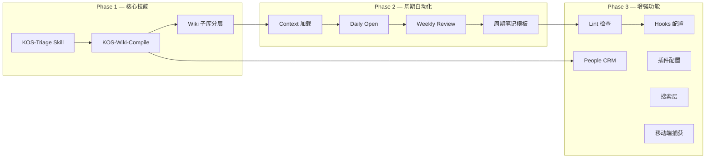

# V1.1 规划 — KOS_LLM-Wiki 整合系统架构演进

> **参考来源：**
> - [PARA × LLM-Wiki 融合系统]([[0 Inbox/Clippings/LifeOS × LLM-Wiki 融合系统.md|LifeOS × LLM-Wiki 融合系统]])（一只阿木木, 2026）
> - [KOS_LLM-Wiki 整合系统 v2.0]([[_meta/架构说明书.md|KOS_LLM-Wiki 整合系统 v2.0]])
> - [C4 模型示例图]([[_meta/assets/c4-context.md|C4 模型示例图]])

---

## 1. 状态评估

### 1.1 当前架构（v2.0）已覆盖

| 模块 | 状态 | 对应 LifeOS 设计 |
|------|------|------------------|
| 目录结构 | ✅ | 第一章：Vault 目录结构 |
| 宪法文件 (AGENTS.md) | ✅ | 第二章：CLAUDE.md 根宪法 |
| 审计日志 (_logs/) | ✅ | AI-Log/ 本地化 |
| ADR 架构决策 | ✅ | 新增（超越原设计） |
| C4 模型文档 | ✅ | 新增（超越原设计） |
| 多语言架构 | ✅ | 新增（超越原设计） |
| UDC 分类体系 | ✅ | 新增（超越原设计） |

### 1.2 待实现（v1.1 范围）

| # | 模块 | 原设计章节 | 优先级 | 复杂度 |
|---|------|-----------|--------|--------|
| 1 | KOS-Triage Skill | 第三章 Skill 1 | P0 | 中 |
| 2 | KOS-Wiki-Compile Skill | 第三章 Skill 2 | P0 | 高 |
| 3 | Context 加载 | 第三章 Skill 3 | P1 | 低 |
| 4 | Daily Open | 第三章 Skill 4 | P1 | 低 |
| 5 | Weekly Review | 第三章 Skill 5 | P1 | 中 |
| 6 | Lint 检查 | 第三章 Skill 6 | P2 | 中 |
| 7 | Hooks 配置 | 第四章 | P2 | 低 |
| 8 | Wiki 子库分层 | 第五章 | P0 | 高 |
| 9 | People CRM | 第六章 | P2 | 高 |
| 10 | 周期笔记模板 | 第七章 | P1 | 低 |
| 11 | 插件配置清单 | 第八章 | P2 | 低 |
| 12 | 搜索层 (QMD) | 第九章 | P2 | 中 |
| 13 | 移动端捕获 | 第十章 | P2 | 低 |

---

## 2. 实施路线图

### Phase 1 — 核心技能（P0, 本月）

#### 1.1 KOS-Triage Skill

**目标：** 实现 Inbox 到目标目录的智能分拣，替代人工整理。

```yaml
# 预期接口
/triage                    # 分拣 0 Inbox 中所有未处理文件
/triage --file <path>      # 分拣指定文件
/triage --status           # 查看当前 Inbox 状态
```

**关键设计决策：**
- 分拣策略写入 `AGENTS.md` 而非独立 Skill 文件（Codex 无 .claude/skills/ 机制）
- 分拣规则：时效性分析 → 主题识别 → 路由决策 → 写入日志
- 输出：目标目录（`1 Projects/` / `2 Areas/` / `Periodic/`）+ `_logs/operations/triage.md`

**输出物：**
- `AGENTS.md` — 新增 KOS-Triage 分拣规则章节
- `_logs/operations/triage.md` — 分拣操作日志（首次创建）

#### 1.2 KOS-Wiki-Compile Skill

**目标：** 从 `3 Resources/` 中的原始资料自动编译结构化知识页面。

```yaml
/wiki-compile              # 编译所有未编译的原始资料
/wiki-compile <topic>      # 编译指定主题
/wiki-compile --status     # 查看编译状态
```

**关键设计决策：**
- 编译流程：来源分析 → 概念提取 → 页面创建/更新 → 交叉引用 → 索引更新 → 日志
- 原始资料标记 frontmatter `compiled: true/false`
- 编译产物存放于 `3 Resources/[topic]/` 下

**输出物：**
- `AGENTS.md` — 新增 Compile 编译规则章节
- `_logs/operations/compile.md` — 编译操作日志（首次创建）

#### 1.3 Wiki 子库分层

**目标：** 将 `3 Resources/` 下的子库升级为 raw/ + wiki/ 双层结构。

| 当前 | 目标 |
|------|------|
| `3 Resources/000-Knowledge/004-LLM-Wiki/` | `3 Resources/000-Knowledge/004-LLM-Wiki/raw/` + `3 Resources/000-Knowledge/004-LLM-Wiki/wiki/` |
| `3 Resources/000-Knowledge/001-PARA/` | `3 Resources/000-Knowledge/001-PARA/raw/` + `3 Resources/000-Knowledge/001-PARA/wiki/` |
| `3 Resources/000-Knowledge/025-UDC/` | `3 Resources/000-Knowledge/025-UDC/raw/` + `3 Resources/000-Knowledge/025-UDC/wiki/` |

**关键决策：**
- `raw/` — 原始资料，人类写入，Codex 只读
- `wiki/` — 编译产物，Codex 写入，人类只读
- 保留现有的 wiki-style 链接兼容性

---

### Phase 2 — 周期自动化（P1, 下月）

#### 2.1 Context 加载

每次会话启动时自动读取最近状态：
- 最近 3 条会话日志
- 当前 Inbox 待处理数量
- 项目活跃状态
- 未完成任务

#### 2.2 Daily Open

会话开始时自动创建当日日记（如不存在）：
- 读取 `Periodic/` 检查今日日记
- 如不存在，使用 `_meta/Templates/每日笔记模板.md` 创建
- 填充当日任务清单

#### 2.3 Weekly Review

每周回顾自动化：
- 统计本周操作（来自 `_logs/operations/`）
- 汇总本周 Wiki 变更
- 生成周报至 `_logs/reports/weekly.md`
- 建议下周期待办

#### 2.4 周期笔记模板

完善 `_meta/Templates/` 中的周期笔记模板：

| 模板 | 当前 | 目标 |
|------|------|------|
| 每日笔记模板 | ✅ 已有 | 增加 Agent 操作记录区块 |
| 领域模板 | ✅ 已有 | — |
| 项目模板 | ✅ 已有 | — |
| 资源模板 | ✅ 已有 | — |
| 概念模板 | ✅ 已有 | — |
| 周记模板 | ❌ 缺失 | 新建 |
| 月记模板 | ❌ 缺失 | 新建 |
| ADR 模板 | ✅ 已新建 | — |

---

### Phase 3 — 增强功能（P2, 三个月内）

#### 3.1 KOS-Link 系统检查

```yaml
`KOS-Link`                      # 运行系统健康检查
`KOS-Link --fix`                # 自动修复可修复项
`KOS-Link --verbose`            # 详细报告
```

检查项：
- Frontmatter 完整性（created/updated/udc/tags 是否缺失）
- UDC 类号是否在索引中
- 断链检测（wiki 链接指向不存在的文件）
- 跨语言一致性（三语言版本是否同步）
- 未归档的已完成项目

#### 3.2 Hooks 配置

在 `AGENTS.md` 中定义会话生命周期：

```markdown
## 会话协议

### 会话开始
1. 运行 Context 加载
2. 检查 0 Inbox 待处理

### 会话结束
1. 写入会话日志到 _logs/sessions/
2. 更新操作日志到 _logs/operations/
3. 检查是否有未完成任务需要提醒
```

#### 3.3 People CRM

实现基于 `_meta/Templates/` 的人物管理：
- 人物页模板（人脉 CRM）
- 人物分层：Tier 1（深度）/ Tier 2（基础）/ Tier 3（存根）
- 互动历史记录

#### 3.4 插件配置

归档 Obsidian 推荐插件清单至 `_meta/plugins.md`：
- LifeOS、Templater、Dataview、Obsidian Tasks
- Periodic Notes、Calendar
- Obsidian Git、Web Clipper

#### 3.5 搜索层

评估 QMD 集成方案：
- 方案 A：安装 QMD CLI，在 AGENTS.md 中定义搜索指令
- 方案 B：利用 Obsidian 内置搜索（更低门槛）

#### 3.6 移动端捕获

评估移动端快速捕获方案：
- 方案 A：`0 Inbox/Clippings/` 手动放置（当前）
- 方案 B：Telegram Bot → 自动写入（需外部服务）
- 方案 C：iOS Shortcut → iCloud 同步（推荐）

---

## 3. 依赖关系



---

## 4. 里程碑

| 里程碑 | 日期 | 交付物 |
|--------|------|--------|
| M1: KOS-Triage 可用 | +7d | AGENTS.md KOS-Triage 规则 + triage.md 日志 |
| M2: KOS-Wiki-Compile 可用 | +14d | AGENTS.md Compile 规则 + compile.md 日志 |
| M3: Wiki 子库分层完成 | +21d | 3 Resources 下 raw/ + wiki/ 重组织 |
| M4: 周期自动化上线 | +45d | Daily Open + Weekly Review 可运行 |
| M5: Lint 可用 | +60d | 系统健康检查可自动执行 |
| M6: 功能完整 | +90d | 全部 P2 功能完成，系统进入维护期 |

---

## 5. 风险与缓解

| 风险 | 影响 | 概率 | 缓解措施 |
|------|------|------|----------|
| Codex 不支持 Skills 机制 | 高 | 高 | 将 Skill 逻辑写入 AGENTS.md 自然语言指令 |
| Wiki 子库分层破坏现有链接 | 高 | 中 | 保留兼容性层（symlink 或 redirect） |
| 编译质量不稳定 | 中 | 中 | 人工审核机制 + compiled: true 标记 |
| 会话上下文丢失 | 中 | 低 | _logs/sessions/ 提供历史恢复 |
| 三语言同步增加维护成本 | 低 | 中 | 仅核心笔记强制同步，日志类单语言 |

---

> **文档状态：** 规划草案 v0.1 · 2026-06-06
> **维护者：** 本规划随系统实际使用反馈调整，每两周评审一次进度。


