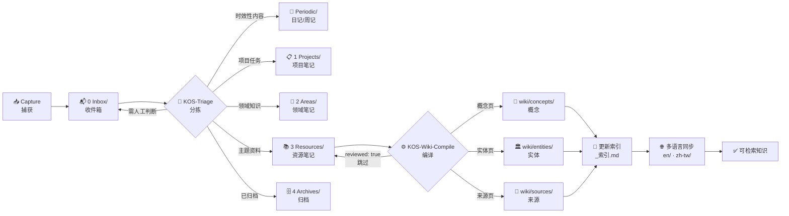
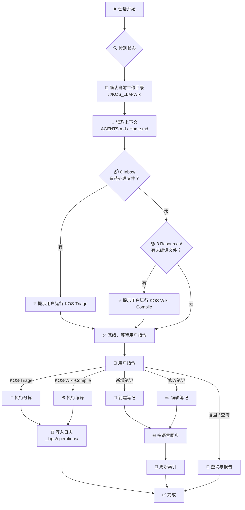
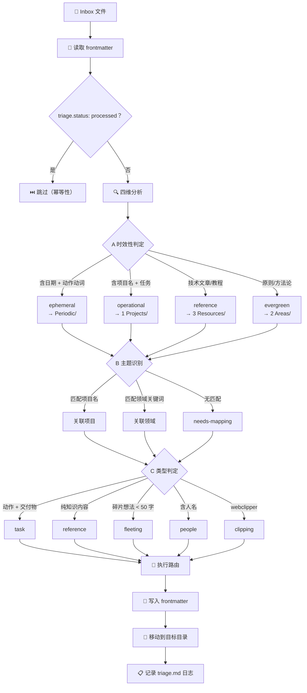
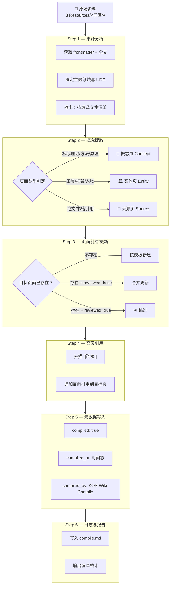
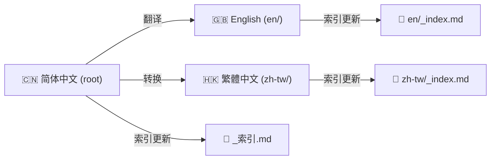

# KOS_LLM-Wiki 工作流程总图

> **UDC 001.8:004.8** — 知识组织系统全生命周期工作流。
>
> 本文档定义从内容捕获到发布的端到端管道，以及 AI Agent 的操作流程。

---

## 1. 内容生命周期管道

从内容进入系统到最终成为可检索知识，经历六个阶段：

### 阶段说明

| 阶段 | 触发器 | 输出 | 负责人 |
|------|--------|------|--------|
| **Capture** 捕获 | 用户手动 / Web Clipper / 速记 | `0 Inbox/` 新 `.md` 文件 | 用户 |
| **Triage** 分拣 | `KOS-Triage` 命令 / 会话自动提示 | 文件路由到 PARA 目录 + `triage.md` 日志 | Agent |
| **Compile** 编译 | `KOS-Wiki-Compile` 命令 / 会话自动提示 | wiki/ 概念/实体/来源页 + `compile.md` 日志 | Agent |
| **Index** 索引 | 每次新增/修改笔记后 | `_索引.md` / `en/_index.md` / `zh-tw/_index.md` 更新 | Agent |
| **Sync** 多语言同步 | 新增/修改笔记时同步执行 | `en/` + `zh-tw/` 镜像目录的对应文件 | Agent |
| **Review** 人工审核 | 用户主动查看 | `reviewed: true` 标记 | 用户 |

---

## 2. Agent 会话工作流

每次 AI Agent 启动会话时的标准操作流程：

---

## 3. KOS-Triage 分拣流程

Inbox 文件从收件箱路由到正确目录的决策树：

### 路由目标矩阵

| 四维分析结果 | 目标目录 | 说明 |
|-------------|----------|------|
| ephemeral | `Periodic/YYYY/MM/` | 按日期归档的时效性内容 |
| operational | `1 Projects/<项目名>/` | 匹配到项目则归入，否则标记 |
| reference | `3 Resources/<子库>/` | 按 UDC 归入 000-Knowledge 下对应子库 |
| evergreen | `2 Areas/<领域>/` | 持续关注的责任领域 |
| fleeting | `0 Inbox/_processed/` | 简短碎片，标记后归档 |
| people | `2 Areas/人脉/` 或 `3 Resources/<子库>/` | 人物笔记 |
| clipping | `3 Resources/<子库>/raw/` | Web 剪藏原始资料 |

---

## 4. KOS-Wiki-Compile 编译流程

从原始资料到结构化 wiki 页面的六步管道：

### 编译阈值

| 条件 | 处理方式 |
|------|----------|
| 文件 < 50 字 | 跳过，标记 `too-short` |
| 文件 > 10,000 字 | 跳过，标记 `long-doc`，建议拆分 |
| `compiled: true` 且 `reviewed: true` | 跳过（保护人工审核内容） |
| `compiled: true` 且 `reviewed: false` | 重新编译合并 |

---

## 5. 多语言同步流程

新增或修改笔记后，同步三个语言版本的步骤：

### 同步规则

| 元素 | 同步方式 |
|------|----------|
| `created` 日期 | 三语言保持一致 |
| `udc` 分类号 | 三语言保持一致 |
| `tags` 标签 | 三语言保持一致 |
| 文件命名 | 简体中文→中文空格；English→kebab-case；繁体中文→中文空格 |
| 内容正文 | 分别翻译，保持结构对齐 |
| 镜像路径 | `en/` + `zh-tw/` 镜像根目录 PARA 结构 |

---

## 6. 触发器汇总

| 触发方式 | 命令/条件 | 执行动作 |
|----------|-----------|----------|
| **完整分拣** | `KOS-Triage` | 全量扫描 Inbox |
| **单文件分拣** | `KOS-Triage --file <路径>` | 仅处理指定文件 |
| **分拣状态** | `KOS-Triage --status` | 输出 Inbox 待处理概览 |
| **完整编译** | `KOS-Wiki-Compile` | 全量扫描 3 Resources |
| **按主题编译** | `KOS-Wiki-Compile --topic <子库>` | 仅编译指定子库 |
| **单文件编译** | `KOS-Wiki-Compile --file <路径>` | 仅编译单个文件 |
| **编译状态** | `KOS-Wiki-Compile --status` | 输出编译状态总览 |
| **会话自动提示** | Inbox 有未处理 / 资源未编译 | 提示用户执行对应操作 |

---

## 7. 相关文档

| 文档 | 路径 | 说明 |
|------|------|------|
| 架构说明书 | [[_meta/架构说明书\|架构说明书]] | 系统架构总览 |
| AGENTS.md | [[AGENTS\|AGENTS.md]] | AI 助手操作规范 |
| KOS-Triage 详细设计 | [[_meta/design/KOS-Triage详细设计\|KOS-Triage 设计]] | 分拣引擎详细设计 |
| KOS-Wiki-Compile 详细设计 | [[_meta/design/KOS-Wiki-Compile详细设计\|KOS-Wiki-Compile 设计]] | 编译引擎详细设计 |
| 子模块分解 | [[_meta/v1.1-子模块分解\|子模块分解]] | 可执行工作包 |
| ADR 索引 | [[_meta/adr/README\|ADR 索引]] | 架构决策记录 |
