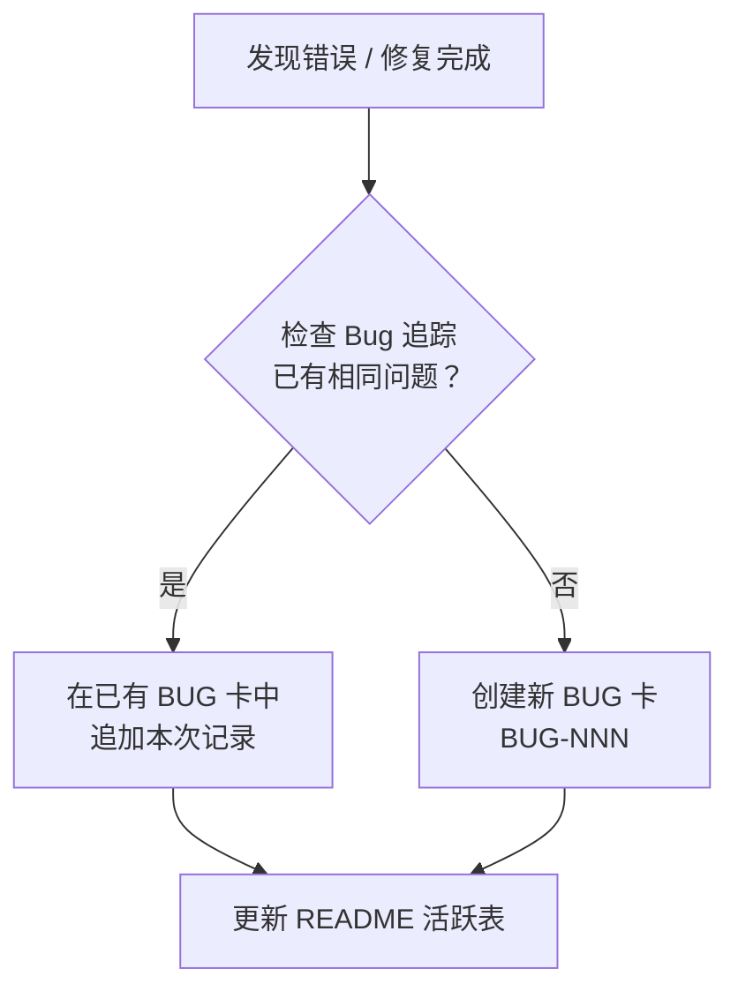

# 错误处理流程

> 当发现并修复错误时，按此流程处理 Bug 追踪记录。

---

## 流程



### 步骤详解

#### ① 检查已有 Bug

打开 `1 Projects/26-02 Bug追踪/README.md`，查看所有 Bug（含已关闭），判断当前错误是否属于已知问题的再次发生。

**判断标准：**
- 相同根因（如 PowerShell 编码问题 → BUG-006）
- 相同现象模式（如文件乱码、表格损坏）
- 相同影响模块

#### ② 已有相同问题 → 追加记录

在已有 BUG 卡的 **「影响范围」** 或 **「复发记录」** 区追加：

```markdown
## 复发记录

| 日期 | 波及文件 | 修复方式 |
|------|---------|---------|
| 2026-06-09 | `1 Projects/26-03 文件锁实现/README.md` | 手动重建（git 无干净版本） |
```

同时更新 `README.md` 中该 Bug 的状态（如 `已修复 → 已修复（1 次复发）`）。

#### ③ 新错误 → 新建 BUG 卡

按 `BUG-NNN-标题.md` 命名，放在 `1 Projects/26-02 Bug追踪/bugs/` 目录。

模板：

```markdown
---
created: YYYY-MM-DD
updated: YYYY-MM-DD
udc: 004.4:004.8
tags: [bug, <模块>]
severity: low|medium|high|critical
status: open|fixed|closed
project: KOS-LLM-Wiki
module: <影响模块>
---

# BUG-NNN: <标题>

## 现象

...

## 根因

...

## 修复

...
```

---

## 严重度分级

| 级别 | 定义 | 示例 |
|------|------|------|
| critical | 数据丢失、功能完全不可用 | 文件被覆写清空 |
| high | 数据损坏、核心流程中断 | 编码乱码、断链 |
| medium | 功能异常但有变通方案 | 表格格式错误、路径不对 |
| low | 外观/体验问题 | 排版不齐、错别字 |

---

## 关联文档

- [[1 Projects/26-02 Bug追踪/README|26-02 Bug 追踪]]
- [[AGENTS.md]]
