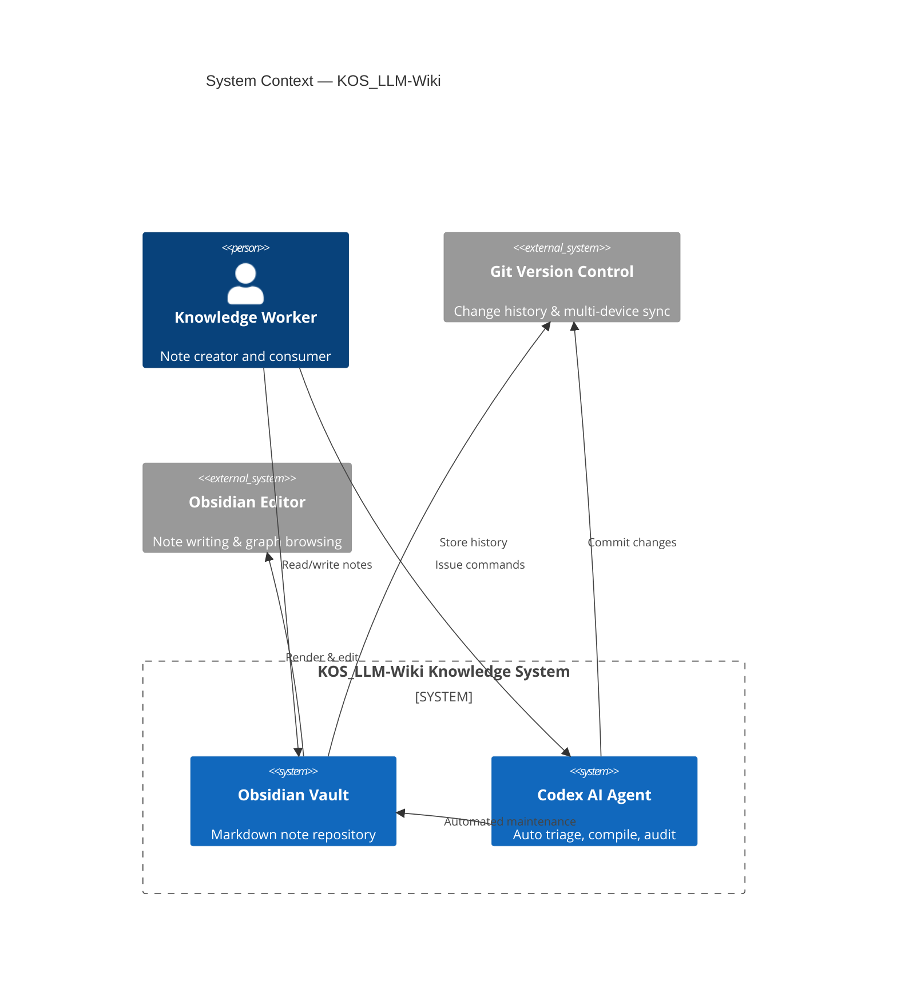
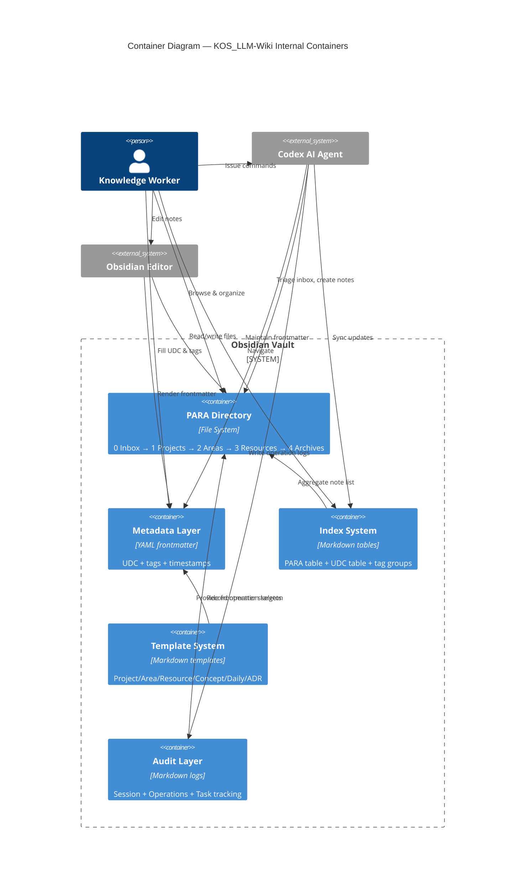
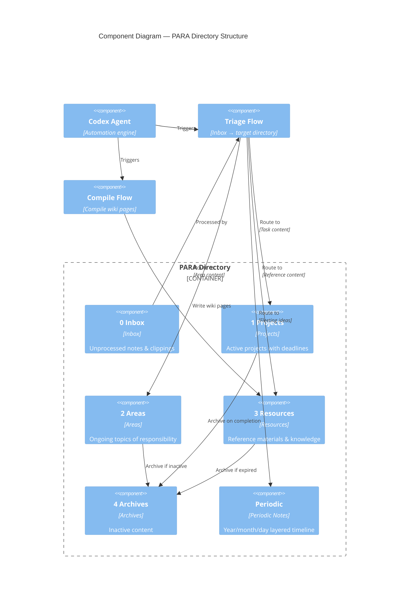
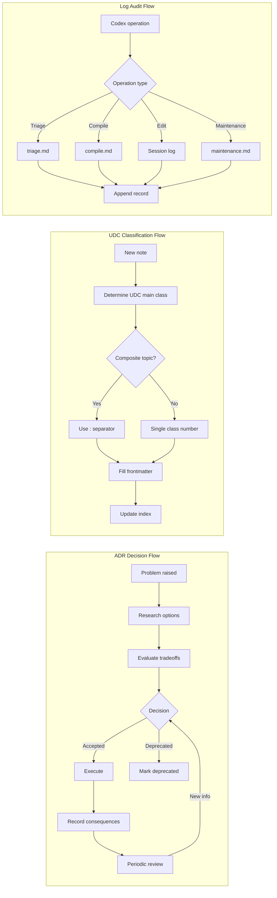

---
created: 2026-06-06
updated: 2026-06-06
udc: 004.4
tags: [c4, architecture, diagram, software-engineering]
---

# C4 Model Diagrams — KOS_LLM-Wiki

> **Reference Architecture:** PARA × LLM-Wiki Fusion System + LifeOS Design Philosophy
> **Tool:** Mermaid.js (inline Markdown rendering)

---

## L1 — Context

### L1 Description

| Element | Role |
|---------|------|
| **Knowledge Worker** | Core user. Creates notes, issues commands, consumes knowledge |
| **Obsidian Vault** | Markdown note repository. Stores all content & metadata |
| **Codex AI Agent** | Automated maintenance engine. Performs triage, compile, logging |
| **Git** | Version control backend. Ensures traceability & rollback |
| **Obsidian Editor** | Frontend tool. Provides graph view, bidirectional links, templates |

---

## L2 — Container View

### L2 Description

| Container | Technology | Responsibility |
|-----------|------------|----------------|
| **PARA Directory** | Filesystem dirs | Organize notes by Inbox/Projects/Areas/Resources/Archives |
| **Metadata Layer** | YAML frontmatter | UDC, tags, timestamps per note |
| **Index System** | Markdown tables | Master index (PARA + UDC + tags) |
| **Template System** | Templater templates | Standardized skeleton for new notes |
| **Audit Layer** | Markdown logs | Full-chain audit trail for Codex operations |

---

## L3 — Component View: PARA Directory Structure

### L3 Description

| Component | Lifecycle | Operator |
|-----------|-----------|----------|
| **0 Inbox** | Capture → Process | Human writes, Codex triages |
| **1 Projects** | Execute → Archive | Human + Codex |
| **2 Areas** | Maintain → Archive | Human + Codex |
| **3 Resources** | Reference → Archive | Human writes raw, Codex compiles wiki |
| **4 Archives** | Dormant | Codex auto-archives |
| **Periodic** | Journal | Human + Codex |

---

## L4 — Code Patterns (ADR & Flows)

---

## Legend & Usage

| C4 Level | View | Audience | File Location |
|----------|------|----------|---------------|
| L1 Context | System panorama | All stakeholders | `_meta/assets/c4-context.md` |
| L2 Container | Technical containers | Architects, developers | `_meta/assets/c4-container.md` |
| L3 Component | Component details | Developers | `_meta/assets/c4-component.md` |
| L4 Code | Key patterns | Developers | `_meta/assets/c4-patterns.md` |

### Rendering Requirements

C4 diagrams use Mermaid.js syntax. Obsidian requires **Mermaid plugin** or native Mermaid support (v1.8+ built-in). Diagrams render automatically in Obsidian Publish.

---

> **Maintainer:** These C4 diagrams should stay in sync with `_meta/architecture.md`. Update the corresponding level when system architecture changes.

