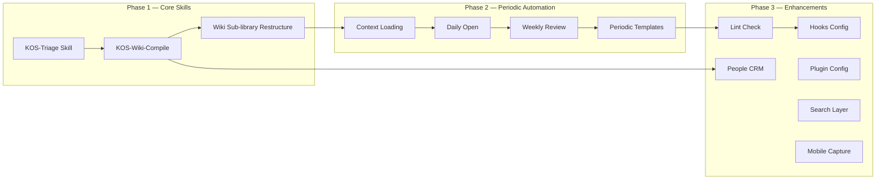

# V1.1 Roadmap — KOS_LLM-Wiki Integrated System Architecture Evolution

> **References:**
> - [PARA × LLM-Wiki Fusion System](https://mp.weixin.qq.com/s/uEAegrqhsM1WKcqlVfuE2w) (by 一只阿木木, 2026)
> - [KOS_LLM-Wiki Integrated System v2.0](/_meta/架构说明书.md)
> - [C4 Model Diagrams](/_meta/assets/c4-context.md)

---

## 1. Status Assessment

### 1.1 Current Architecture (v2.0) Coverage

| Module | Status | LifeOS Design Equivalent |
|--------|--------|--------------------------|
| Directory Structure | ✅ | Chapter 1: Vault Structure |
| Constitution (AGENTS.md) | ✅ | Chapter 2: CLAUDE.md |
| Audit Logs (_logs/) | ✅ | AI-Log/ localized |
| ADR Decisions | ✅ | New (beyond original) |
| C4 Model Docs | ✅ | New (beyond original) |
| Multi-language | ✅ | New (beyond original) |
| UDC Classification | ✅ | New (beyond original) |

### 1.2 To Be Implemented (v1.1 Scope)

| # | Module | Original Chapter | Priority | Complexity |
|---|--------|-----------------|----------|------------|
| 1 | KOS-Triage Skill | Chapter 3 Skill 1 | P0 | Medium |
| 2 | KOS-Wiki-Compile Skill | Chapter 3 Skill 2 | P0 | High |
| 3 | Context Loading | Chapter 3 Skill 3 | P1 | Low |
| 4 | Daily Open | Chapter 3 Skill 4 | P1 | Low |
| 5 | Weekly Review | Chapter 3 Skill 5 | P1 | Medium |
| 6 | Lint Check | Chapter 3 Skill 6 | P2 | Medium |
| 7 | Hooks Config | Chapter 4 | P2 | Low |
| 8 | Wiki Sub-library Restructure | Chapter 5 | P0 | High |
| 9 | People CRM | Chapter 6 | P2 | High |
| 10 | Periodic Note Templates | Chapter 7 | P1 | Low |
| 11 | Plugin Config Guide | Chapter 8 | P2 | Low |
| 12 | Search Layer (QMD) | Chapter 9 | P2 | Medium |
| 13 | Mobile Capture | Chapter 10 | P2 | Low |

---

## 2. Implementation Roadmap

### Phase 1 — Core Skills (P0, This Month)

#### 1.1 KOS-Triage Skill

**Goal:** Intelligent Inbox routing to target directories, replacing manual sorting.

```yaml
# Expected interface
/triage                    # Process all unhandled files in 0 Inbox
/triage --file <path>      # Process specific file
/triage --status           # View current Inbox status
```

**Key Design Decisions:**
- KOS-Triage rules written into `AGENTS.md` (no .claude/skills/ mechanism in Codex)
- Routing: timeliness analysis → topic recognition → route decision → log write
- Output: target directory + `_logs/operations/triage.md`

**Deliverables:**
- `AGENTS.md` — New KOS-Triage rules section
- `_logs/operations/triage.md` — First triage operation log

#### 1.2 KOS-Wiki-Compile Skill

**Goal:** Auto-compile structured knowledge pages from `3 Resources/` source materials.

```yaml
/wiki-compile              # Compile all uncompiled materials
/wiki-compile <topic>      # Compile specific topic
/wiki-compile --status     # View compile status
```

**Key Design Decisions:**
- Compile flow: source analysis → concept extraction → page create/update → cross-ref → index update → log
- Source material frontmatter flag: `compiled: true/false`
- Compiled output stored under `3 Resources/[topic]/`

#### 1.3 Wiki Sub-library Restructure

**Goal:** Upgrade `3 Resources/` sub-libraries to raw/ + wiki/ two-layer structure.

| Current | Target |
|---------|--------|
| `3 Resources/000-Knowledge/004-LLM-Wiki/` | `3 Resources/000-Knowledge/004-LLM-Wiki/raw/` + `3 Resources/000-Knowledge/004-LLM-Wiki/wiki/` |
| `3 Resources/000-Knowledge/001-PARA/` | `3 Resources/000-Knowledge/001-PARA/raw/` + `3 Resources/000-Knowledge/001-PARA/wiki/` |
| `3 Resources/000-Knowledge/025-UDC/` | `3 Resources/000-Knowledge/025-UDC/raw/` + `3 Resources/000-Knowledge/025-UDC/wiki/` |

**Key Decisions:**
- `raw/` — Source materials, human-writes, Codex read-only
- `wiki/` — Compiled output, Codex-writes, human read-only
- Preserve backward compatibility for existing wiki links

---

### Phase 2 — Periodic Automation (P1, Next Month)

#### 2.1 Context Loading

Auto-load recent state at session start:
- Last 3 session logs
- Current Inbox count
- Active project status
- Unfinished tasks

#### 2.2 Daily Open

Auto-create today's daily note at session start (if absent):
- Check `Periodic/` for today's note
- Create via `daily-note-template.md` if missing
- Populate today's task list

#### 2.3 Weekly Review

Automated weekly review:
- Aggregate weekly operations from `_logs/operations/`
- Summarize Wiki changes
- Generate weekly report to `_logs/reports/weekly.md`
- Suggest next week's priorities

#### 2.4 Periodic Note Templates

Complete template set in `_meta/Templates/`:

| Template | Status | Target |
|----------|--------|--------|
| Daily | ✅ Existing | Add Agent operation block |
| Area | ✅ Existing | — |
| Project | ✅ Existing | — |
| Resource | ✅ Existing | — |
| Concept | ✅ Existing | — |
| Weekly | ❌ Missing | New |
| Monthly | ❌ Missing | New |
| ADR | ✅ Added | — |

---

### Phase 3 — Enhancements (P2, Within 3 Months)

#### 3.1 KOS-Link System Check

```yaml
`KOS-Link`                      # Run system health check
`KOS-Link --fix`                # Auto-fix fixable items
`KOS-Link --verbose`            # Detailed report
```

Check items:
- Frontmatter completeness (created/updated/udc/tags)
- UDC number registered in index
- Broken wiki links
- Cross-language sync consistency
- Unarchived completed projects

#### 3.2 Hooks Configuration

Session lifecycle documented in `AGENTS.md`:

```markdown
## Session Protocol

### Session Start
1. Run Context loading
2. Check 0 Inbox for pending items

### Session End
1. Write session log to _logs/sessions/
2. Update operation logs in _logs/operations/
3. Flag any unfinished tasks for reminder
```

#### 3.3 People CRM

Person management via `_meta/Templates/`:
- Person page template (CRM)
- Tier system: T1 (deep) / T2 (basic) / T3 (stub)
- Interaction history tracking

#### 3.4 Plugin Configuration

Archive Obsidian plugin recommendations to `_meta/plugins.md`:
- LifeOS, Templater, Dataview, Obsidian Tasks
- Periodic Notes, Calendar
- Obsidian Git, Web Clipper

#### 3.5 Search Layer

Evaluate QMD integration:
- Option A: Install QMD CLI, define search commands in AGENTS.md
- Option B: Use Obsidian built-in search (lower barrier)

#### 3.6 Mobile Capture

Evaluate mobile capture solutions:
- Option A: Manual `0 Inbox/Clippings/` (current)
- Option B: Telegram Bot → auto-write (needs external service)
- Option C: iOS Shortcut → iCloud sync (recommended)

---

## 3. Dependency Graph



---

## 4. Milestones

| Milestone | Date | Deliverable |
|-----------|------|-------------|
| M1: KOS-Triage ready | +7d | AGENTS.md KOS-Triage rules + triage.md log |
| M2: KOS-Wiki-Compile ready | +14d | AGENTS.md Compile rules + compile.md log |
| M3: Wiki restructure done | +21d | raw/ + wiki/ under 3 Resources |
| M4: Periodic automation live | +45d | Daily Open + Weekly Review operational |
| M5: Lint available | +60d | System health check auto-runnable |
| M6: Feature complete | +90d | All P2 features done, system in maintenance |

---

## 5. Risks & Mitigation

| Risk | Impact | Probability | Mitigation |
|------|--------|-------------|------------|
| Codex doesn't support Skills mechanism | High | High | Embed Skill logic in AGENTS.md as natural language instructions |
| Wiki restructure breaks existing links | High | Medium | Compatibility layer (symlinks or redirects) |
| Compile quality unstable | Medium | Medium | Human review gate + compiled: true flag |
| Session context loss | Medium | Low | _logs/sessions/ provides history recovery |
| Trilingual sync increases maintenance cost | Low | Medium | Only core notes force-synced; logs single-language |

---

> **Document Status:** Planning draft v0.1 · 2026-06-06
> **Maintainer:** This roadmap adjusts based on actual usage feedback; bi-weekly progress review.

