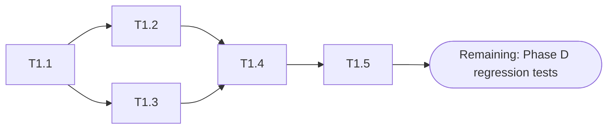
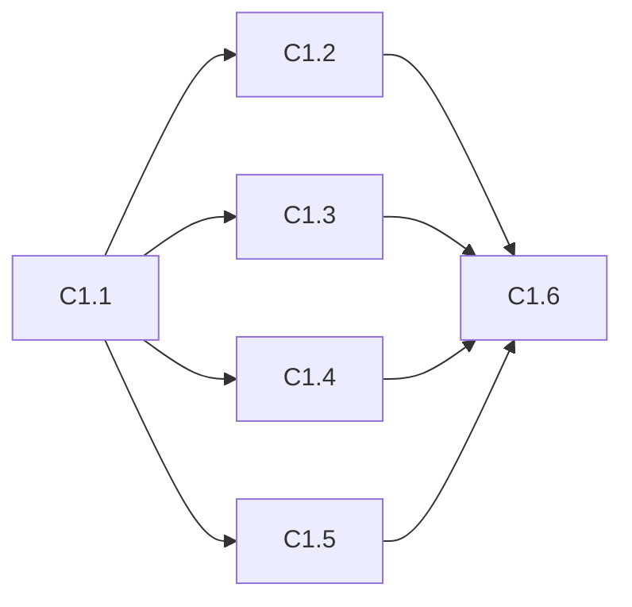
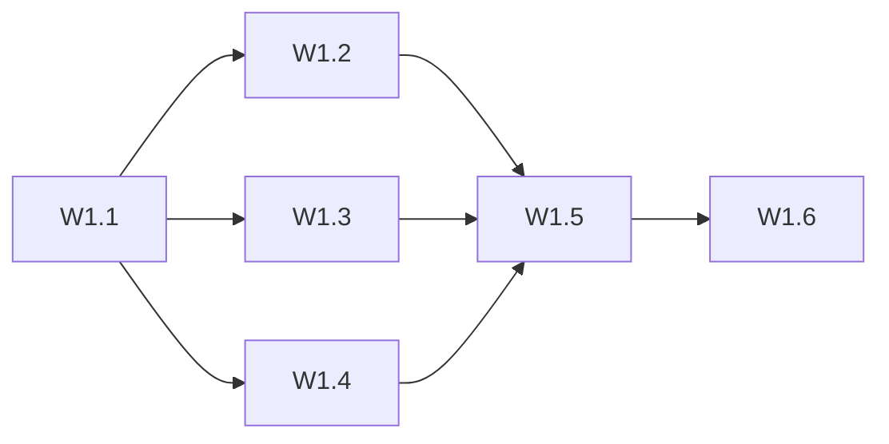
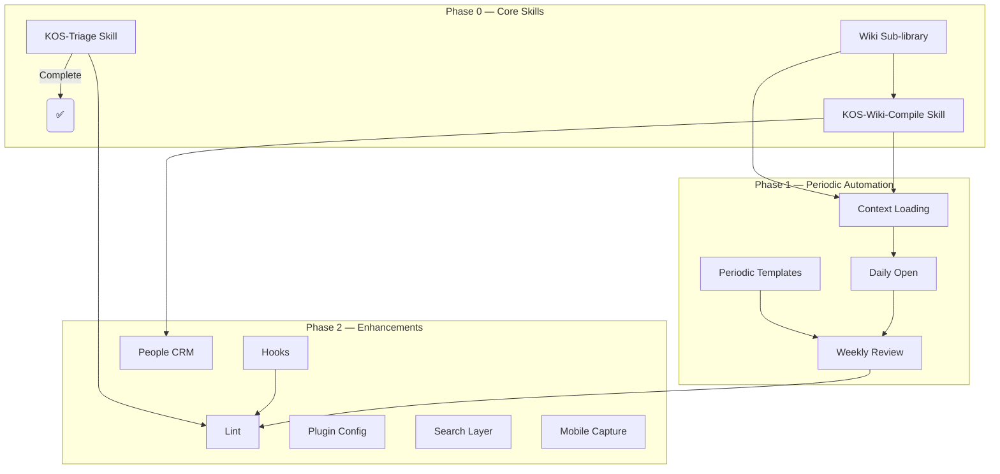

---
created: 2026-06-06
updated: 2026-06-06
udc: 001.8:004.8
tags: [roadmap, planning, wbs, decomposition]
---

# V1.1 Sub-module Decomposition — Executable Work Packages

> Decompose the 13 modules in the V1.1 roadmap into independently executable work packages.
> Reference: [[en/_meta/v1.1-roadmap.md]]

---

## Overall Progress

| Phase | Module | Sub-modules | Done | Progress |
|-------|--------|-------------|------|----------|
| **P0** | M1 KOS-Triage | 5 | 5 | **100%** |
| **P0** | M2 KOS-Wiki-Compile | 6 | 0 | **0%** |
| **P0** | M3 Wiki Sub-library | 6 | 0 | **0%** |
| **P1** | M4–M7 (4 modules) | 12 | 0 | **0%** |
| **P2** | M8–M13 (6 modules) | 25 | 0 | **0%** |
| **Total** | **13 modules** | **54** | **5** | **9%** |

| Metric | Value |
|--------|-------|
| Total estimated effort | 32h |
| Completed effort | 3.5h (M1) |
| Remaining effort | 28.5h |
| Completion rate | 11% |

---

## P0 — Core Skills (This Month)

### M1: KOS-Triage Skill ✅ (Complete)

**Goal:** Intelligent Inbox routing to target directories, replacing manual sorting.

| Sub-module | Input | Output | Acceptance | Est. | Status |
|------------|-------|--------|------------|------|--------|
| T1.1 KOS-Triage rules | V1.1 plan, LifeOS design | `AGENTS.md` KOS-Triage section | Covers timeliness/topic/person/dual-attribute 4D analysis | 1h | ✅ |
| T1.2 Route mapping | Current directories | Route decision matrix | Each content type → exactly one target directory | 0.5h | ✅ |
| T1.3 Log format | _logs requirements spec | `_logs/operations/triage.md` template | Includes time/count/routing distribution/exceptions | 0.5h | ✅ |
| T1.4 First triage run | Current 0 Inbox content | Files routed + log written | Inbox cleared or all marked processed | 1h | ✅ |
| T1.5 Report template | — | KOS-Triage output format | Human-readable, includes statistics | 0.5h | ✅ |

**Total: 3.5h** — Complete

**Execution record:** 2026-06-06 first triage of 3 files, all successfully routed (3 Resources ×1, 2 Areas ×1, Periodic ×1). See `_logs/operations/triage.md`.



---

### M2: KOS-Wiki-Compile Skill

**Goal:** Auto-compile structured knowledge pages from source materials.

| Sub-module | Input | Output | Acceptance | Est. | Status |
|------------|-------|--------|------------|------|--------|
| C1.1 Compile rules | V1.1 plan, LifeOS design | `AGENTS.md` Compile section | Source analysis→concept extraction→page creation→xref→index update | 1.5h | ❌ |
| C1.2 Compile status flag | — | `compiled: true/false` frontmatter convention | Status visible via frontmatter query | 0.5h | ❌ |
| C1.3 Page type templates | Concept/resource templates | Concept/Entity/Source compile templates | Each has frontmatter + skeleton + source citation | 1h | ❌ |
| C1.4 Cross-reference rules | Existing wiki pages | wikilink auto-discovery + backlink rules | New [[links]] auto-appended to target pages | 1h | ❌ |
| C1.5 Log format | _logs requirements spec | `_logs/operations/compile.md` template | Source/new pages/updated pages/contradictions | 0.5h | ❌ |
| C1.6 First compile run | 3 Resources content | Selected topic compiled + log written | At least one topic through full compile chain | 2h | ❌ |

**Total: 6.5h** — Not started

**Prerequisite:** M3 Wiki Sub-library (raw/ + wiki/ structure is prerequisite for compile output)



---

### M3: Wiki Sub-library Restructure

**Goal:** Upgrade 3 Resources sub-libraries to raw/ + wiki/ two-layer structure.

| Sub-module | Input | Output | Acceptance | Est. | Status |
|------------|-------|--------|------------|------|--------|
| W1.1 Directory planning | Current 3 Resources | raw/ + wiki/ creation plan | No files lost | 0.5h | ❌ |
| W1.2 LLM-Wiki split | 3 Resources/LLM-Wiki | raw/ + wiki/ assignment | Knowledge → wiki, source → raw | 1h | ❌ |
| W1.3 PARA split | 3 Resources/PARA | raw/ + wiki/ assignment | Same | 0.5h | ❌ |
| W1.4 UDC split | 3 Resources/UDC | raw/ + wiki/ assignment | Same | 0.5h | ❌ |
| W1.5 Link compatibility | All wiki file path refs | Updated links | No broken links, index navigable | 1h | ❌ |
| W1.6 Index update | _index.md / en / zh-tw | Updated index | 3 Resources paths correct | 0.5h | ❌ |

**Total: 4h** — Not started

> **Note:** This module must strictly follow AGENTS.md batch-deletion prohibition. Each step must be file-by-file.



---

## P1 — Periodic Automation (Next Month)

### M4: Context Loading

| Sub-module | Est. | Status |
|------------|------|--------|
| CT1.1 Context data sources definition (sessions/ / Inbox / Projects / tasks) | 0.5h | ❌ |
| CT1.2 AGENTS.md Context loading rules | 0.5h | ❌ |
| CT1.3 Session opening info template | 0.5h | ❌ |

**Total: 1.5h** — Not started

### M5: Daily Open

| Sub-module | Est. | Status |
|------------|------|--------|
| D1.1 Daily note template enhancement (add Agent operation block) | 0.5h | ❌ |
| D1.2 AGENTS.md Daily Open rules (check existence → create → populate) | 0.5h | ❌ |
| D1.3 Task list auto-population rules (from 1 Projects/ unfinished tasks) | 0.5h | ❌ |

**Total: 1.5h** — Not started

### M6: Weekly Review

| Sub-module | Est. | Status |
|------------|------|--------|
| WK1.1 Weekly report template (`_meta/Templates/weekly-template.md`) | 0.5h | ❌ |
| WK1.2 Operation aggregation rules (from `_logs/operations/` weekly) | 1h | ❌ |
| WK1.3 Knowledge growth statistics (new/updated pages) | 0.5h | ❌ |
| WK1.4 Next week suggestion generation rules | 0.5h | ❌ |
| WK1.5 AGENTS.md Weekly Review rules | 0.5h | ❌ |

**Total: 3h** — Not started

### M7: Periodic Templates

| Sub-module | Est. | Status |
|------------|------|--------|
| PT1.1 Weekly template (EN) | 0.5h | ❌ |
| PT1.2 Monthly template (EN) | 0.5h | ❌ |
| PT1.3 Trilingual sync (en/zh-tw) | 1h | ❌ |

**Total: 2h** — Not started

---

## P2 — Enhancements (Within 3 Months)

### M8: Lint Check

| Sub-module | Est. | Status |
|------------|------|--------|
| L1.1 Frontmatter completeness check | 0.5h | ❌ |
| L1.2 UDC index validation | 0.5h | ❌ |
| L1.3 Broken link detection | 1h | ❌ |
| L1.4 Cross-language consistency check | 0.5h | ❌ |
| L1.5 Unarchived project check | 0.5h | ❌ |
| L1.6 Auto-fix strategy (--fix) | 1h | ❌ |
| L1.7 Report format & log record | 0.5h | ❌ |

**Total: 4.5h** — Not started

### M9: Hooks Configuration

| Sub-module | Est. | Status |
|------------|------|--------|
| H1.1 Session start protocol | 0.5h | ❌ |
| H1.2 Session end protocol | 0.5h | ❌ |
| H1.3 AGENTS.md Hooks section | 0.5h | ❌ |

**Total: 1.5h** — Not started

### M10: People CRM

| Sub-module | Est. | Status |
|------------|------|--------|
| P1.1 Person page template (Tier 1/2/3) | 1h | ❌ |
| P1.2 Person recognition & clue extraction | 1h | ❌ |
| P1.3 Interaction history format | 0.5h | ❌ |
| P1.4 Privacy rules | 0.5h | ❌ |

**Total: 3h** — Not started

### M11: Plugin Configuration

| Sub-module | Est. | Status |
|------------|------|--------|
| PL1.1 Required plugins + config | 0.5h | ❌ |
| PL1.2 Recommended plugins + use cases | 0.5h | ❌ |
| PL1.3 Optional plugins + decision guide | 0.5h | ❌ |

**Total: 1.5h** — Not started

### M12: Search Layer

| Sub-module | Est. | Status |
|------------|------|--------|
| S1.1 Search needs analysis (current bottlenecks) | 0.5h | ❌ |
| S1.2 QMD evaluation (install + CLI commands) | 0.5h | ❌ |
| S1.3 Obsidian native search optimization | 0.5h | ❌ |
| S1.4 Decision + AGENTS.md search section | 0.5h | ❌ |

**Total: 2h** — Not started

### M13: Mobile Capture

| Sub-module | Est. | Status |
|------------|------|--------|
| M1.1 Needs analysis (what scenarios need mobile capture) | 0.5h | ❌ |
| M1.2 iOS Shortcut design | 0.5h | ❌ |
| M1.3 Multi-device sync strategy (iCloud / Syncthing) | 0.5h | ❌ |
| M1.4 Documentation (AGENTS.md or standalone) | 0.5h | ❌ |

**Total: 2h** — Not started

---

## Effort Summary

| Phase | Module | Sub-modules | Done | Est. effort | Done effort | Remaining |
|-------|--------|-------------|------|-------------|-------------|-----------|
| P0 | M1 KOS-Triage | 5 | 5 | 3.5h | 3.5h | 0h |
| P0 | M2 KOS-Wiki-Compile | 6 | 0 | 6.5h | 0h | 6.5h |
| P0 | M3 Wiki Sub-library | 6 | 0 | 4h | 0h | 4h |
| P1 | M4 Context | 3 | 0 | 1.5h | 0h | 1.5h |
| P1 | M5 Daily Open | 3 | 0 | 1.5h | 0h | 1.5h |
| P1 | M6 Weekly Review | 5 | 0 | 3h | 0h | 3h |
| P1 | M7 Periodic Templates | 3 | 0 | 2h | 0h | 2h |
| P2 | M8 Lint | 7 | 0 | 4.5h | 0h | 4.5h |
| P2 | M9 Hooks | 3 | 0 | 1.5h | 0h | 1.5h |
| P2 | M10 People CRM | 4 | 0 | 3h | 0h | 3h |
| P2 | M11 Plugin Config | 3 | 0 | 1.5h | 0h | 1.5h |
| P2 | M12 Search Layer | 4 | 0 | 2h | 0h | 2h |
| P2 | M13 Mobile Capture | 4 | 0 | 2h | 0h | 2h |
| **Total** | **13 modules** | **54** | **5** | **32h** | **3.5h** | **28.5h** |

> At ~5h/week: remaining 28.5h ÷ 5h ≈ 6 weeks. Total: ~7 weeks.

---

## Priority Recommendations

### Current Suggested Order

```
M1 KOS-Triage — ✅ Complete
─────────────────────────
M3 Wiki Sub-library   ← Prerequisite for M2 (raw/ + wiki/ structure)
M2 KOS-Wiki-Compile       ← Start after M3
─────────────────────────
P1 modules (M4-M7)    ← After P0 complete
P2 modules (M8-M13)   ← Last
```

**Suggested immediate start:** M3 (Sub-library) → M2 (Compile rules can start in parallel)

### Monthly Plan (Updated)

```
Month 1 (current): M1 KOS-Triage ✅ | M3 Sub-library | M2 Compile rules
Month 2:           M2 Compile execute | M4 Context | M5 Daily | M7 Templates
Month 3:           M6 Weekly | M8 Lint | M9 Hooks
Month 4:           M10 CRM | M11 Plugins | M12 Search | M13 Mobile
```

---

## Dependency Graph


