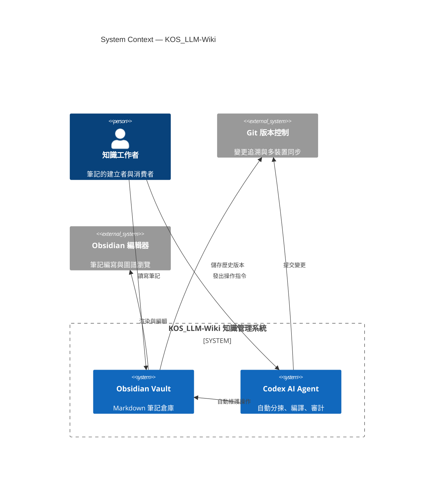
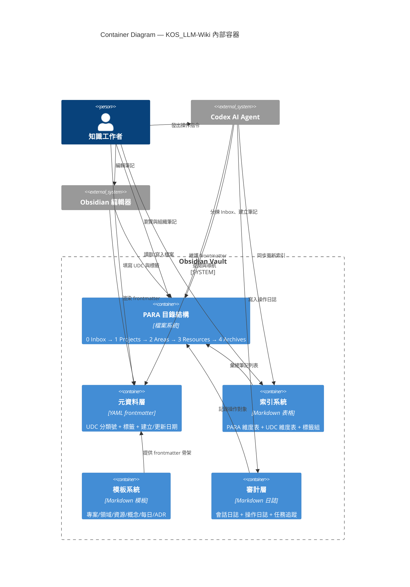
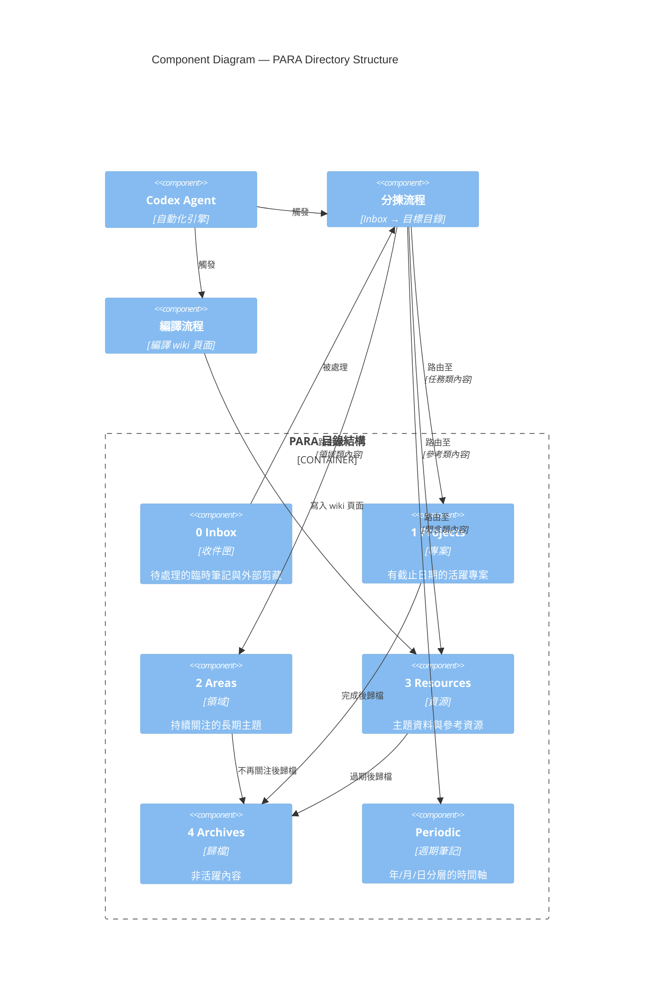
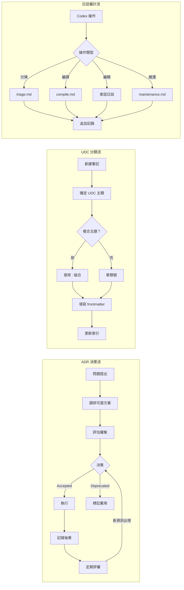

---
created: 2026-06-06
updated: 2026-06-06
udc: 004.4
tags: [c4, architecture, diagram, software-engineering]
---

# C4 模型範例圖 — KOS_LLM-Wiki

> **參考架構：** PARA × LLM-Wiki 融合系統 + LifeOS 設計哲學
> **工具：** Mermaid.js（Markdown 內聯渲染）

---

## L1 — Context 系統上下文

### L1 說明

| 元素 | 角色 |
|------|------|
| **知識工作者** | 系統的核心使用者。建立筆記、發出指令、消費知識 |
| **Obsidian Vault** | Markdown 筆記倉庫。儲存所有內容與元資料 |
| **Codex AI Agent** | 自動化維護引擎。執行分揀、編譯、日誌記錄 |
| **Git** | 版本控制後端。確保變更可追溯、可回滾 |
| **Obsidian 編輯器** | 前端工具。提供圖譜檢視、雙向連結、模板等功能 |

---

## L2 — Container 容器視圖

### L2 說明

| 容器 | 技術實現 | 職責 |
|------|----------|------|
| **PARA 目錄結構** | 檔案系統目錄 | 按 Inbox/Projects/Areas/Resources/Archives 組織筆記 |
| **元資料層** | YAML frontmatter | 每條筆記的 UDC 分類號、標籤、時間戳 |
| **索引系統** | Markdown 表格 | 總索引（PARA 表 + UDC 表 + 標籤組） |
| **模板系統** | Templater 模板 | 新建筆記時的標準化骨架 |
| **審計層** | Markdown 日誌 | Codex 操作的全鏈路審計追蹤 |

---

## L3 — Component 組件視圖：PARA 目錄結構

### L3 說明

| 組件 | 生命週期 | 操作者 |
|------|----------|--------|
| **0 Inbox** | 捕獲 → 處理 | 人類寫入，Codex 分揀 |
| **1 Projects** | 執行 → 歸檔 | 人類 + Codex |
| **2 Areas** | 維護 → 歸檔 | 人類 + Codex |
| **3 Resources** | 參考 → 歸檔 | 人類寫入 raw，Codex 編譯 wiki |
| **4 Archives** | 休眠 | Codex 自動歸檔 |
| **Periodic** | 日記 | 人類 + Codex |

---

## L4 — Code 層級（關鍵模式）

---

## 圖例與使用說明

| C4 層 | 視圖 | 讀者 | 檔案位置 |
|-------|------|------|----------|
| L1 Context | 系統全景 | 所有參與者 | `_meta/assets/c4-context.md` |
| L2 Container | 技術容器 | 架構師、開發者 | `_meta/assets/c4-container.md` |
| L3 Component | 組件細節 | 開發者 | `_meta/assets/c4-component.md` |
| L4 Code | 關鍵模式 | 開發者 | `_meta/assets/c4-patterns.md` |

### Mermaid 渲染要求

本系統 C4 圖使用 Mermaid.js 語法。Obsidian 中需要安裝 **Mermaid** 外掛或啟用 **Obsidian 原生 Mermaid** 支援（v1.8+ 內建）。若使用 Obsidian Publish，Mermaid 圖自動渲染。

---

> **維護者：** 這些 C4 圖應與 `zh-tw/_meta/架構說明書.md` 同步更新。當系統架構發生變更時，更新對應層次的圖。

