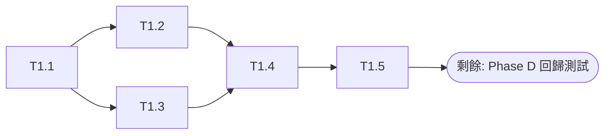
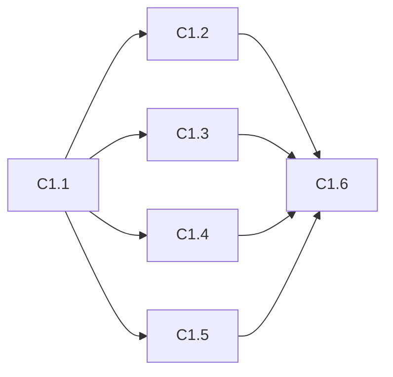
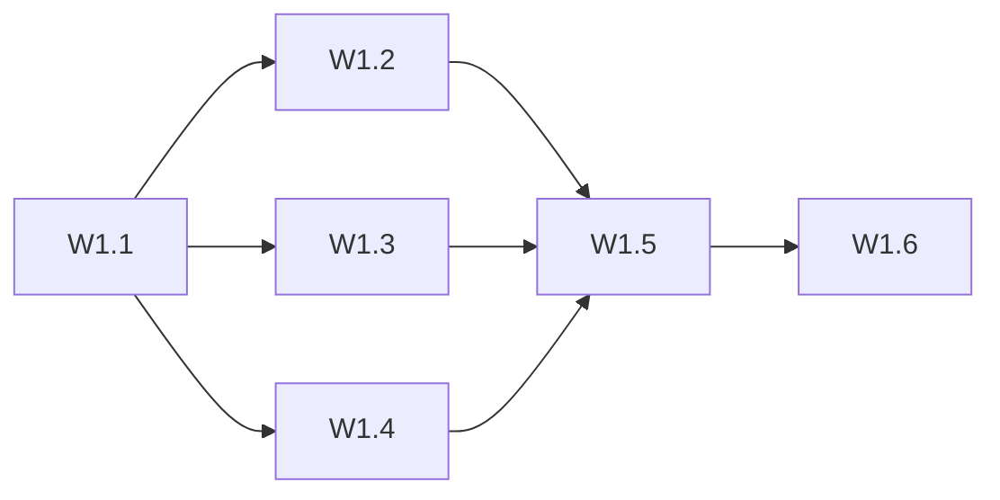
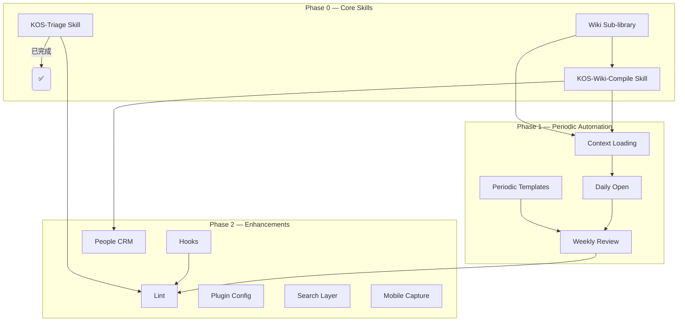

---
created: 2026-06-06
updated: 2026-06-06
udc: 001.8:004.8
tags: [roadmap, planning, wbs, decomposition]
---

# V1.1 子模組分解 — 可執行工作包

> 將 V1.1 規劃的 13 個模組拆解為可獨立執行的工作包，每個子模組定義輸入、輸出、驗收標準與估算工時。
> 參考：[[zh-tw/_meta/v1.1規劃.md]]

---

## 整體進度

| Phase | 模組 | 子模組數 | 已完成 | 佔比 |
|-------|------|----------|--------|------|
| **P0** | M1 KOS-Triage | 5 | 5 | **100%** |
| **P0** | M2 KOS-Wiki-Compile | 6 | 0 | **0%** |
| **P0** | M3 Wiki 子庫分層 | 6 | 0 | **0%** |
| **P1** | M4–M7 (4 模組) | 12 | 0 | **0%** |
| **P2** | M8–M13 (6 模組) | 25 | 0 | **0%** |
| **總計** | **13 模組** | **54** | **5** | **9%** |

| 度量 | 值 |
|------|-----|
| 總估算工時 | 32h |
| 已完成工時 | 3.5h (M1) |
| 剩餘工時 | 28.5h |
| 完成百分比 | 11% |

---

## P0 — 核心技能（本月）

### M1: KOS-Triage Skill ✅ (已全部完成)

**目標：** 實現 Inbox 智慧分揀，替代人工整理。

| 子模組 | 輸入 | 輸出 | 驗收標準 | 估算 | 狀態 |
|--------|------|------|----------|------|------|
| T1.1 分揀規則定義 | v1.1 規劃、LifeOS 原設計 | `AGENTS.md` KOS-Triage 章節 | 規則涵蓋時效性/主題/人物/雙重屬性四維分析 | 1h | ✅ |
| T1.2 路由對映表 | 目前目錄結構 | 路由決策矩陣 | 每種內容類型有且僅有一個目標目錄 | 0.5h | ✅ |
| T1.3 日誌格式定義 | _logs 需求說明書 | `_logs/operations/triage.md` 模板 | 包含時間/處理數/路由分佈/異常記錄 | 0.5h | ✅ |
| T1.4 首次分揀執行 | 0 Inbox 現有內容 | 檔案路由到位 + 日誌寫入 | Inbox 清零或全部標記 processed | 1h | ✅ |
| T1.5 分揀報告模板 | — | 分揀結果輸出格式 | 人類可讀、包含統計摘要 | 0.5h | ✅ |

**合計：3.5h** — 已完成

**執行記錄：** 2026-06-06 首次分揀 3 個檔案，全部成功路由（3 Resources ×1, 2 Areas ×1, Periodic ×1）。詳見 `_logs/operations/triage.md`。



---

### M2: KOS-Wiki-Compile Skill

**目標：** 從原始資料自動編譯結構化知識頁面。

| 子模組 | 輸入 | 輸出 | 驗收標準 | 估算 | 狀態 |
|--------|------|------|----------|------|------|
| C1.1 編譯規則定義 | v1.1 規劃、LifeOS 原設計 | `AGENTS.md` Compile 章節 | 流程覆蓋來源分析→概念提取→頁面建立→交叉引用→索引更新 | 1.5h | ❌ |
| C1.2 編譯狀態標記 | — | `compiled: true/false` frontmatter 約定 | 原始資料可透過 frontmatter 判斷編譯狀態 | 0.5h | ❌ |
| C1.3 頁面類型模板 | 概念模板、資源模板 | 概念頁/實體頁/來源頁三種編譯模板 | 每種模板有 frontmatter + 章節骨架 + 來源引用格式 | 1h | ❌ |
| C1.4 交叉引用規則 | 現有 wiki 頁面 | wikilink 自動發現與反向連結追加規則 | 新頁面中的 [[連結]] 自動追加到目標頁面的反向引用區 | 1h | ❌ |
| C1.5 日誌格式定義 | _logs 需求說明書 | `_logs/operations/compile.md` 模板 | 包含來源/新建頁面/更新頁面/矛盾記錄 | 0.5h | ❌ |
| C1.6 首次編譯執行 | 3 Resources 現有內容 | 選定主題首次編譯 + 日誌寫入 | 至少完成一個主題的完整編譯鏈路 | 2h | ❌ |

**合計：6.5h** — 未啟動

**前置依賴：** M3 Wiki 子庫分層（raw/ + wiki/ 結構是編譯產物的存放前提）



---

### M3: Wiki 子庫分層

**目標：** 3 Resources 下的子庫升級為 raw/ + wiki/ 雙層結構。

| 子模組 | 輸入 | 輸出 | 驗收標準 | 估算 | 狀態 |
|--------|------|------|----------|------|------|
| W1.1 目錄結構規劃 | 目前 3 Resources 內容 | raw/ + wiki/ 目錄建立方案 | 不丟失任何現有檔案 | 0.5h | ❌ |
| W1.2 LLM-Wiki 子庫拆分 | 3 Resources/LLM-Wiki | raw/ + wiki/ 檔案分配 | 知識性內容歸 wiki/，原始內容歸 raw/ | 1h | ❌ |
| W1.3 PARA 子庫拆分 | 3 Resources/PARA | raw/ + wiki/ 檔案分配 | 同上 | 0.5h | ❌ |
| W1.4 UDC 子庫拆分 | 3 Resources/UDC | raw/ + wiki/ 檔案分配 | 同上 | 0.5h | ❌ |
| W1.5 連結相容性處理 | 所有 wiki 檔案中的路徑引用 | 更新後的連結 | 無斷鏈，驗證索引可正常導航 | 1h | ❌ |
| W1.6 索引更新 | zh-tw/_index.md | 更新後的索引 | 3 Resources 下路徑正確 | 0.5h | ❌ |

**合計：4h** — 未啟動

> **注意：** 執行此模組需嚴格遵守 AGENTS.md 禁止批次刪除的規則，每個步驟需逐檔案操作。



---

## P1 — 週期自動化（下月）

### M4: Context 載入

| 子模組 | 估算 | 狀態 |
|--------|------|------|
| CT1.1 上下文資料來源定義（sessions/ / Inbox / Projects / tasks） | 0.5h | ❌ |
| CT1.2 AGENTS.md Context 載入規則 | 0.5h | ❌ |
| CT1.3 會話開場資訊模板 | 0.5h | ❌ |

**合計：1.5h** — 未啟動

### M5: Daily Open

| 子模組 | 估算 | 狀態 |
|--------|------|------|
| D1.1 每日筆記模板完善（增加 Agent 操作記錄區塊） | 0.5h | ❌ |
| D1.2 AGENTS.md Daily Open 規則（檢查存在性 → 建立 → 填充） | 0.5h | ❌ |
| D1.3 任務清單自動填入規則（來自 1 Projects/ 未完成任務） | 0.5h | ❌ |

**合計：1.5h** — 未啟動

### M6: Weekly Review

| 子模組 | 估算 | 狀態 |
|--------|------|------|
| WK1.1 週報模板建立（`_meta/Templates/weekly-template.md`） | 0.5h | ❌ |
| WK1.2 操作聚合規則（從 `_logs/operations/` 按週彙總） | 1h | ❌ |
| WK1.3 知識增長統計（新增/更新頁面數） | 0.5h | ❌ |
| WK1.4 下週建議生成規則 | 0.5h | ❌ |
| WK1.5 AGENTS.md Weekly Review 規則 | 0.5h | ❌ |

**合計：3h** — 未啟動

### M7: 週期筆記模板

| 子模組 | 估算 | 狀態 |
|--------|------|------|
| PT1.1 週記模板（繁體） | 0.5h | ❌ |
| PT1.2 月記模板（繁體） | 0.5h | ❌ |
| PT1.3 三語言同步 | 1h | ❌ |

**合計：2h** — 未啟動

---

## P2 — 增強功能（三個月內）

### M8: Lint 檢查

| 子模組 | 估算 | 狀態 |
|--------|------|------|
| L1.1 Frontmatter 完整性檢查規則 | 0.5h | ❌ |
| L1.2 UDC 索引驗證規則 | 0.5h | ❌ |
| L1.3 斷鏈檢測規則 | 1h | ❌ |
| L1.4 跨語言一致性檢查規則 | 0.5h | ❌ |
| L1.5 未歸檔專案檢查規則 | 0.5h | ❌ |
| L1.6 自動修復策略（--fix） | 1h | ❌ |
| L1.7 報告格式與日誌記錄 | 0.5h | ❌ |

**合計：4.5h** — 未啟動

### M9: Hooks 設定

| 子模組 | 估算 | 狀態 |
|--------|------|------|
| H1.1 會話開始協議定義 | 0.5h | ❌ |
| H1.2 會話結束協議定義 | 0.5h | ❌ |
| H1.3 AGENTS.md Hooks 章節整合 | 0.5h | ❌ |

**合計：1.5h** — 未啟動

### M10: People CRM

| 子模組 | 估算 | 狀態 |
|--------|------|------|
| P1.1 人物頁模板（Tier 1/2/3 三種級別） | 1h | ❌ |
| P1.2 人物識別與線索提取規則 | 1h | ❌ |
| P1.3 互動歷史記錄格式 | 0.5h | ❌ |
| P1.4 隱私規則定義 | 0.5h | ❌ |

**合計：3h** — 未啟動

### M11: 外掛設定

| 子模組 | 估算 | 狀態 |
|--------|------|------|
| PL1.1 必裝外掛清單 + 設定要點 | 0.5h | ❌ |
| PL1.2 推薦外掛清單 + 適用場景 | 0.5h | ❌ |
| PL1.3 可選外掛清單 + 決策建議 | 0.5h | ❌ |

**合計：1.5h** — 未啟動

### M12: 搜尋層

| 子模組 | 估算 | 狀態 |
|--------|------|------|
| S1.1 搜尋需求分析（當前瓶頸在哪裡） | 0.5h | ❌ |
| S1.2 QMD 方案評估（安裝 + CLI 指令定義） | 0.5h | ❌ |
| S1.3 Obsidian 原生搜尋最佳化方案 | 0.5h | ❌ |
| S1.4 選擇決策與 AGENTS.md 搜尋章節 | 0.5h | ❌ |

**合計：2h** — 未啟動

### M13: 行動端捕獲

| 子模組 | 估算 | 狀態 |
|--------|------|------|
| M1.1 需求分析（什麼場景需要行動端捕獲） | 0.5h | ❌ |
| M1.2 iOS Shortcut 方案設計與說明 | 0.5h | ❌ |
| M1.3 多裝置同步策略（iCloud / Syncthing） | 0.5h | ❌ |
| M1.4 方案文件（AGENTS.md 或獨立文件） | 0.5h | ❌ |

**合計：2h** — 未啟動

---

## 工時匯總

| Phase | 模組 | 子模組數 | 已完成 | 估算工時 | 已完成工時 | 剩餘工時 |
|-------|------|----------|--------|----------|------------|----------|
| P0 | M1 KOS-Triage | 5 | 5 | 3.5h | 3.5h | 0h |
| P0 | M2 KOS-Wiki-Compile | 6 | 0 | 6.5h | 0h | 6.5h |
| P0 | M3 Wiki 子庫分層 | 6 | 0 | 4h | 0h | 4h |
| P1 | M4 Context | 3 | 0 | 1.5h | 0h | 1.5h |
| P1 | M5 Daily Open | 3 | 0 | 1.5h | 0h | 1.5h |
| P1 | M6 Weekly Review | 5 | 0 | 3h | 0h | 3h |
| P1 | M7 週期筆記模板 | 3 | 0 | 2h | 0h | 2h |
| P2 | M8 Lint | 7 | 0 | 4.5h | 0h | 4.5h |
| P2 | M9 Hooks | 3 | 0 | 1.5h | 0h | 1.5h |
| P2 | M10 People CRM | 4 | 0 | 3h | 0h | 3h |
| P2 | M11 外掛設定 | 3 | 0 | 1.5h | 0h | 1.5h |
| P2 | M12 搜尋層 | 4 | 0 | 2h | 0h | 2h |
| P2 | M13 行動端捕獲 | 4 | 0 | 2h | 0h | 2h |
| **總計** | **13 模組** | **54** | **5** | **32h** | **3.5h** | **28.5h** |

> 按每週 5h 投入估算：剩餘 28.5h ÷ 5h ≈ 6 週。加上已完成的 3.5h，總計約 **7 週**。

---

## 執行優先順序

### 當前建議順序

```
M1 KOS-Triage — ✅ 已完成
────────────────────────
M3 Wiki 子庫分層  ← M2 的前置條件（raw/ + wiki/ 結構）
M2 KOS-Wiki-Compile   ← 依賴 M3 完成後啟動
────────────────────────
P1 模組 (M4-M7)   ← P0 完成後啟動
P2 模組 (M8-M13)  ← 最後
```

**建議立即啟動：** M3（子庫分層）→ M2（Compile 規則定義可並行開始）

### 月度規劃（更新版）

```
第 1 月（當前）: M1 KOS-Triage ✅ | M3 子庫分層 | M2 Compile 規則
第 2 月:          M2 Compile 執行 | M4 Context | M5 Daily | M7 模板
第 3 月:          M6 Weekly | M8 Lint | M9 Hooks
第 4 月:          M10 CRM | M11 外掛 | M12 搜尋 | M13 行動端
```

---

## 依賴總圖


