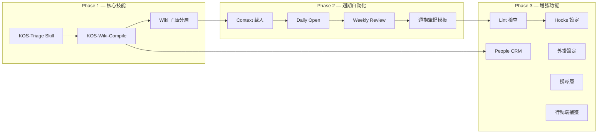

# V1.1 規劃 — KOS_LLM-Wiki 整合系統架構演進

> **參考來源：**
> - [PARA × LLM-Wiki 融合系統](https://mp.weixin.qq.com/s/uEAegrqhsM1WKcqlVfuE2w)（一隻阿木木, 2026）
> - [KOS_LLM-Wiki 整合系統 v2.0](/_meta/架構說明書.md)
> - [C4 模型範例圖](/_meta/assets/c4-context.md)

---

## 1. 狀態評估

### 1.1 目前架構（v2.0）已覆蓋

| 模組 | 狀態 | 對應 LifeOS 設計 |
|------|------|------------------|
| 目錄結構 | ✅ | 第一章：Vault 目錄結構 |
| 憲法文件 (AGENTS.md) | ✅ | 第二章：CLAUDE.md 根憲法 |
| 審計日誌 (_logs/) | ✅ | AI-Log/ 本地化 |
| ADR 架構決策 | ✅ | 新增（超越原設計） |
| C4 模型文件 | ✅ | 新增（超越原設計） |
| 多語言架構 | ✅ | 新增（超越原設計） |
| UDC 分類體系 | ✅ | 新增（超越原設計） |

### 1.2 待實現（v1.1 範圍）

| # | 模組 | 原設計章節 | 優先級 | 複雜度 |
|---|------|-----------|--------|--------|
| 1 | KOS-Triage Skill | 第三章 Skill 1 | P0 | 中 |
| 2 | KOS-Wiki-Compile Skill | 第三章 Skill 2 | P0 | 高 |
| 3 | Context 載入 | 第三章 Skill 3 | P1 | 低 |
| 4 | Daily Open | 第三章 Skill 4 | P1 | 低 |
| 5 | Weekly Review | 第三章 Skill 5 | P1 | 中 |
| 6 | Lint 檢查 | 第三章 Skill 6 | P2 | 中 |
| 7 | Hooks 設定 | 第四章 | P2 | 低 |
| 8 | Wiki 子庫分層 | 第五章 | P0 | 高 |
| 9 | People CRM | 第六章 | P2 | 高 |
| 10 | 週期筆記模板 | 第七章 | P1 | 低 |
| 11 | 外掛設定清單 | 第八章 | P2 | 低 |
| 12 | 搜尋層 (QMD) | 第九章 | P2 | 中 |
| 13 | 行動端捕獲 | 第十章 | P2 | 低 |

---

## 2. 實施路線圖

### Phase 1 — 核心技能（P0, 本月）

#### 1.1 KOS-Triage Skill

**目標：** 實現 Inbox 到目標目錄的智慧分揀，替代人工整理。

```yaml
/triage                    # 分揀 0 Inbox 中所有未處理檔案
/triage --file <path>      # 分揀指定檔案
/triage --status           # 檢視目前 Inbox 狀態
```

**關鍵設計決策：**
- 分揀策略寫入 `AGENTS.md`（Codex 無 .claude/skills/ 機制）
- 分揀規則：時效性分析 → 主題識別 → 路由決策 → 寫入日誌
- 輸出：目標目錄 + `_logs/operations/triage.md`

**產出物：**
- `AGENTS.md` — 新增 KOS-Triage 分揀規則章節
- `_logs/operations/triage.md` — 分揀操作日誌（首次建立）

#### 1.2 KOS-Wiki-Compile Skill

**目標：** 從 `3 Resources/` 中的原始資料自動編譯結構化知識頁面。

```yaml
/wiki-compile              # 編譯所有未編譯的原始資料
/wiki-compile <topic>      # 編譯指定主題
/wiki-compile --status     # 檢視編譯狀態
```

**關鍵設計決策：**
- 編譯流程：來源分析 → 概念提取 → 頁面建立/更新 → 交叉引用 → 索引更新 → 日誌
- 原始資料標記 frontmatter `compiled: true/false`
- 編譯產物存放於 `3 Resources/[topic]/` 下

#### 1.3 Wiki 子庫分層

**目標：** 將 `3 Resources/` 下的子庫升級為 raw/ + wiki/ 雙層結構。

| 目前 | 目標 |
|------|------|
| `3 Resources/000-Knowledge/004-LLM-Wiki/` | `3 Resources/000-Knowledge/004-LLM-Wiki/raw/` + `3 Resources/000-Knowledge/004-LLM-Wiki/wiki/` |
| `3 Resources/000-Knowledge/001-PARA/` | `3 Resources/000-Knowledge/001-PARA/raw/` + `3 Resources/000-Knowledge/001-PARA/wiki/` |
| `3 Resources/000-Knowledge/025-UDC/` | `3 Resources/000-Knowledge/025-UDC/raw/` + `3 Resources/000-Knowledge/025-UDC/wiki/` |

**關鍵決策：**
- `raw/` — 原始資料，人類寫入，Codex 唯讀
- `wiki/` — 編譯產物，Codex 寫入，人類唯讀
- 保留現有 wiki-style 連結相容性

---

### Phase 2 — 週期自動化（P1, 下月）

#### 2.1 Context 載入

每次會話啟動時自動讀取最近狀態：
- 最近 3 條會話日誌
- 目前 Inbox 待處理數量
- 專案活躍狀態
- 未完成任務

#### 2.2 Daily Open

會話開始時自動建立當日日記（如不存在）：
- 檢查 `Periodic/` 是否有今日日記
- 如不存在，使用 `每日筆記模板.md` 建立
- 填入當日任務清單

#### 2.3 Weekly Review

每週回顧自動化：
- 統計本週操作（來自 `_logs/operations/`）
- 彙總本週 Wiki 變更
- 產生週報至 `_logs/reports/weekly.md`
- 建議下週待辦

#### 2.4 週期筆記模板

完善 `_meta/Templates/` 中的週期筆記模板：

| 模板 | 目前 | 目標 |
|------|------|------|
| 每日筆記模板 | ✅ 已有 | 增加 Agent 操作記錄區塊 |
| 領域模板 | ✅ 已有 | — |
| 專案模板 | ✅ 已有 | — |
| 資源模板 | ✅ 已有 | — |
| 概念模板 | ✅ 已有 | — |
| 週記模板 | ❌ 缺失 | 新建 |
| 月記模板 | ❌ 缺失 | 新建 |
| ADR 模板 | ✅ 已新建 | — |

---

### Phase 3 — 增強功能（P2, 三個月內）

#### 3.1 KOS-Link 系統檢查

```yaml
`KOS-Link`                      # 執行系統健康檢查
`KOS-Link --fix`                # 自動修復可修復項目
`KOS-Link --verbose`            # 詳細報告
```

檢查項目：
- Frontmatter 完整性（created/updated/udc/tags）
- UDC 類號是否在索引中
- 斷鏈檢測（wiki 連結指向不存在的檔案）
- 跨語言一致性（三語言版本是否同步）
- 未歸檔的已完成專案

#### 3.2 Hooks 設定

在 `AGENTS.md` 中定義會話生命週期：

```markdown
## 會話協議

### 會話開始
1. 執行 Context 載入
2. 檢查 0 Inbox 待處理

### 會話結束
1. 寫入會話日誌到 _logs/sessions/
2. 更新操作日誌到 _logs/operations/
3. 檢查是否有未完成任務需要提醒
```

#### 3.3 People CRM

實現基於模板的人物管理：
- 人物頁模板（人脈 CRM）
- 人物分層：Tier 1（深度）/ Tier 2（基礎）/ Tier 3（存根）
- 互動歷史記錄

#### 3.4 外掛設定

歸檔 Obsidian 推薦外掛清單至 `_meta/plugins.md`：
- LifeOS、Templater、Dataview、Obsidian Tasks
- Periodic Notes、Calendar
- Obsidian Git、Web Clipper

#### 3.5 搜尋層

評估 QMD 整合方案：
- 方案 A：安裝 QMD CLI，在 AGENTS.md 中定義搜尋指令
- 方案 B：利用 Obsidian 內建搜尋（更低門檻）

#### 3.6 行動端捕獲

評估行動端快速捕獲方案：
- 方案 A：`0 Inbox/Clippings/` 手動放置（目前）
- 方案 B：Telegram Bot → 自動寫入（需外部服務）
- 方案 C：iOS Shortcut → iCloud 同步（推薦）

---

## 3. 相依關係



---

## 4. 里程碑

| 里程碑 | 日期 | 交付物 |
|--------|------|--------|
| M1: KOS-Triage 可用 | +7d | AGENTS.md KOS-Triage 規則 + triage.md 日誌 |
| M2: KOS-Wiki-Compile 可用 | +14d | AGENTS.md Compile 規則 + compile.md 日誌 |
| M3: Wiki 子庫分層完成 | +21d | 3 Resources 下 raw/ + wiki/ 重組織 |
| M4: 週期自動化上線 | +45d | Daily Open + Weekly Review 可執行 |
| M5: Lint 可用 | +60d | 系統健康檢查可自動執行 |
| M6: 功能完整 | +90d | 全部 P2 功能完成，系統進入維護期 |

---

## 5. 風險與緩解

| 風險 | 影響 | 機率 | 緩解措施 |
|------|------|------|----------|
| Codex 不支援 Skills 機制 | 高 | 高 | 將 Skill 邏輯寫入 AGENTS.md 自然語言指令 |
| Wiki 子庫分層破壞現有連結 | 高 | 中 | 保留相容性層（symlink 或 redirect） |
| 編譯品質不穩定 | 中 | 中 | 人工審核機制 + compiled: true 標記 |
| 會話上下文遺失 | 中 | 低 | _logs/sessions/ 提供歷史恢復 |
| 三語言同步增加維護成本 | 低 | 中 | 僅核心筆記強制同步，日誌類單語言 |

---

> **文件狀態：** 規劃草案 v0.1 · 2026-06-06
> **維護者：** 本規劃隨系統實際使用回饋調整，每兩週評審一次進度。

